<div dir="rtl">

# راهنمای کاربر مرکز فرماندهی AO-SOC

| | |
|---|---|
| **نویسنده** | J.Ekrami |
| **هم‌نویسنده** | Claude (Opus 5) |
| **حق نشر** | © J.Ekrami-Labs |
| **تاریخ** | تابستان ۱۴۰۵ |
| **نسخهٔ سند** | ۱٫۰ |
| **برای** | `ao-soc` نسخهٔ ۲٫۸٫۹ |

این راهنما برای **کاربران AO-SOC** نوشته شده است: تحلیل‌گر مرکز عملیات امنیت در شیفت، سرپرست شیفت و کسی که سامانه را نصب می‌کند. در آن می‌خوانید سامانه را چگونه نصب کنید، چگونه وارد شوید، هر منو و صفحه چه نشان می‌دهد و یک رخداد را چگونه از صف تا بایگانی پیش ببرید.

این سند راهنمای کاربردی است. برای طراحی، APIها و پیکربندی به [`README.md`](../../README.md)، [`orchestrator/README.md`](../../orchestrator/README.md) و برنامهٔ مرحله‌به‌مرحلهٔ راه‌اندازی در [`docs/PILOT-RUNBOOK.md`](../PILOT-RUNBOOK.md) مراجعه کنید.

همهٔ تصویرها از محیط نمایشی (بخش ۲٫۱) با رابط فارسی گرفته شده‌اند. عنوان‌ها و متن رخدادها داده‌های نمونه‌اند و از ابزارهای تشخیص به همان زبان اصلی (انگلیسی) می‌آیند؛ برچسب‌ها، دکمه‌ها و منوها فارسی‌اند.

---

## فهرست

۱. AO-SOC در یک دقیقه\
۲. نصب\
۳. ورود به سامانه\
۴. چیدمان صفحه و نوار بالا\
۵. مرکز فرماندهی (صفحهٔ اصلی)\
۶. کار روی یک رخداد: تصمیم سطح ۲ هوش مصنوعی\
۷. هشدارهای زنده و راهنمای رخداد\
۸. فهرست رخدادها و جزئیات رخداد\
۹. بایگانی و بازگردانی اقدام‌ها\
۱۰. ریسک موجودیت‌ها\
۱۱. سلامت سامانه\
۱۲. زبان: فارسی و انگلیسی\
۱۳. روال روزانه\
۱۴. واژه‌نامه: نشان‌ها، رنگ‌ها و وضعیت‌ها\
۱۵. رفع اشکال

---

## ۱. AO-SOC در یک دقیقه

AO-SOC **لایهٔ تصمیم‌گیری** یک مرکز عملیات امنیت است. این سامانه **لاگ جمع نمی‌کند، لاگ ذخیره نمی‌کند و حمله را تشخیص نمی‌دهد**. این کارها را ابزارهای موجود شما انجام می‌دهند (Splunk، Wazuh، Elastic، Sentinel، CrowdStrike یا هر ابزاری که CEF می‌فرستد). AO-SOC با آنچه این ابزارها می‌فرستند چهار کار انجام می‌دهد:

۱. **همبسته می‌کند.** تشخیص‌های ابزارهای مختلف دربارهٔ یک کاربر، میزبان یا نشانی در یک بازهٔ زمانی، یک **وضعیت امنیتی** واحد می‌شوند. برای نمونه، یک هشدار brute-force از Splunk، یک ارتقای دسترسی از Wazuh و یک اتصال خروجی مشکوک در فایروال روی یک حساب، یک رخداد می‌شوند نه سه رخداد.\
۲. **تصمیم پیشنهاد می‌کند.** یک مدل هوش مصنوعی محلی (از طریق Ollama و کاملاً درون سازمان) وضعیت را می‌خواند و یک **تصمیم سطح ۲** پیشنهاد می‌دهد: `CONTAIN`، `ESCALATE`، `INVESTIGATE`، `MONITOR` یا `IGNORE`. همراه آن یک **برنامهٔ اقدام یکپارچه** هم پیشنهاد می‌کند، مانند *Block IP*، *Isolate host* یا *Disable account*.\
۳. **از انسان می‌پرسد.** شما برنامه را یک‌بار بررسی می‌کنید و **تأیید برنامه**، **ویرایش** یا **رد** را می‌زنید.\
۴. **اجرا و ثبت می‌کند.** اقدام‌های تأییدشده به ابزارهای پاسخ شما (SOAR، EDR، فایروال، سامانهٔ هویت) فرستاده می‌شوند. هر گام حسابرسی می‌شود و هر اقدامی که قابل بازگردانی باشد از همین داشبورد **بازگردانی** می‌شود.

<div dir="ltr">

```
Detection tools → AO-SOC correlation → AI Tier-2 decision → YOU (approve / edit / reject)
               → policy guardrails → response tools → audit, archive, rollback
```

</div>

> **«راهنما» (Playbook) در AO-SOC.** در این سامانه، راهنما همان **برنامهٔ اقدامی است که به هر تصمیم پیوست می‌شود**. آن را در دو جا می‌بینید: **برنامه اقدام یکپارچه** در پنل تصمیم سطح ۲ هوش مصنوعی، که آن را تأیید می‌کنید و اجرا می‌شود؛ و فهرست **راهنمای رخداد** در صفحهٔ هشدارهای زنده، که فقط خلاصه‌ای از مراحل مهار را نشان می‌دهد. راهنما را دستی نمی‌نویسید. هوش مصنوعی برای هر رخداد یکی پیشنهاد می‌دهد و شما آن را تأیید، اصلاح یا رد می‌کنید.

---

## ۲. نصب

AO-SOC را به دو شکل می‌توان اجرا کرد:

| | کاربرد | بخش |
|---|---|---|
| **نمایشی** | آشنایی، آموزش، ضبط ویدیو. هشدارهای نمونه، بدون نیاز به مدل واقعی | ۲٫۱ |
| **عملیاتی (Docker)** | آزمایش میدانی یا استقرار واقعی با تشخیص‌های واقعی | ۲٫۲ |

### ۲٫۰ پیش‌نیازها

| جزء | نسخه | کاربرد |
|---|---|---|
| Python | ۳٫۱۱ یا بالاتر | کارگزار (حالت نمایشی) |
| Node.js و npm | ۲۰ یا بالاتر | API رابط کاربری و داشبورد (حالت نمایشی) |
| Docker و Docker Compose | نسخهٔ جدید | حالت عملیاتی |
| Ollama با مدل `qwen3.5:latest` (یا `qwen2.5:7b`) | اختیاری | تصمیم‌های واقعی هوش مصنوعی. بدون مدل، سامانه در حالت *بدون مدل* کار می‌کند و یک قاعدهٔ جایگزین تصمیم می‌گیرد |
| مرورگر | Edge، Chrome یا Firefox به‌روز | داشبورد. برای ۱۹۲۰×۱۰۸۰ و بزرگ‌تر طراحی شده؛ روی تبلت و گوشی هم کار می‌کند |

**درگاه‌ها (پورت‌ها)**

| سرویس | درگاه | توضیح |
|---|---|---|
| کارگزار (موتور تصمیم هوش مصنوعی) | `8500` | تشخیص‌ها را دریافت می‌کند |
| API رابط کاربری | `4317` | داده‌های داشبورد را می‌رساند |
| داشبورد (نمایشی، Vite) | `5173` | `http://localhost:5173` |
| داشبورد (عملیاتی، Docker) | `8080` | تنها درگاهی که Docker بیرون می‌دهد. با `DASHBOARD_PORT` قابل تغییر است |

### ۲٫۱ نصب نمایشی (ویندوز، لینوکس، macOS)

**گام ۱. کد را دریافت کنید** و در پوشهٔ `ao-soc` یک ترمینال باز کنید.

**گام ۲. همه‌چیز را با یک فرمان اجرا کنید.**

ویندوز (PowerShell):

<div dir="ltr">

```powershell
.\scripts\start-demo.ps1
```

</div>

لینوکس و macOS:

<div dir="ltr">

```bash
chmod +x scripts/start-demo.sh scripts/stop-demo.sh
./scripts/start-demo.sh
```

</div>

این اسکریپت:

۱. بررسی می‌کند Python و Node نصب باشند،\
۲. وابستگی‌ها را نصب می‌کند (در اجراهای بعدی با `-SkipInstall` یا `--skip-install` از این گام بگذرید)،\
۳. کارگزار، API رابط کاربری و داشبورد را هر کدام در یک پنجرهٔ جدا اجرا می‌کند،\
۴. **۱۲ هشدار نمونه** بارگذاری می‌کند، از جمله یک وضعیت که از سه ابزار همبسته شده است،\
۵. **کلید ورود کاربر را چاپ می‌کند.**

<div dir="ltr">

```text
  Sign in at the dashboard with this operator key:
      Xy7...your-key...Qp
```

</div>

کلید را کپی کنید؛ در [بخش ۳](#۳-ورود-به-سامانه) به آن نیاز دارید.

**گام ۳.** نشانی `http://localhost:5173` را در مرورگر باز کنید.

**گونه‌های حالت نمایشی**

| فرمان (ویندوز / لینوکس) | نتیجه |
|---|---|
| `start-demo.ps1` / `start-demo.sh` | ۱۲ هشدار یک‌جا بارگذاری می‌شود |
| `start-demo.ps1 -Live` / `start-demo.sh --live` | هشدارها در حدود ۲ دقیقه یکی‌یکی می‌رسند و پرشدن صف را می‌بینید |
| `start-demo.ps1 -Ai -Count 6` / `start-demo.sh --ai --count 6` | هوش مصنوعی واقعی: مدل محلی Ollama هر هشدار را تحلیل می‌کند. برای هر هشدار ۱۰ تا ۴۰ ثانیه زمان در نظر بگیرید |

**توقف حالت نمایشی:**

<div dir="ltr">

```powershell
.\scripts\stop-demo.ps1
```

```bash
./scripts/stop-demo.sh
```

</div>

> هر بار که حالت نمایشی را اجرا می‌کنید، هشدارهای نمایشی **از نو ساخته می‌شوند**. اسکریپت‌های نمایشی را روی پایگاه‌دادهٔ عملیاتی اجرا نکنید.

### ۲٫۲ نصب عملیاتی (Docker)

استقرار عملیاتی از برنامهٔ مرحله‌به‌مرحلهٔ [`docs/PILOT-RUNBOOK.md`](../PILOT-RUNBOOK.md) پیروی می‌کند. به‌طور خلاصه:

**گام ۱. فایل تنظیمات را بسازید.**

<div dir="ltr">

```bash
cp deploy/.env.example deploy/.env
```

</div>

**گام ۲. برای هر نفر و هر سامانه یک کلید جدا بسازید.** این فرمان را برای هر کلید یک‌بار اجرا کنید:

<div dir="ltr">

```bash
python -c "import secrets; print(secrets.token_urlsafe(32))"
```

</div>

کلیدها را در `deploy/.env` بنویسید:

| تنظیم | دارندهٔ کلید | نمونه |
|---|---|---|
| `BROKER_API_KEYS` | سامانه‌ها: SIEM با نقش `ingest`، API رابط کاربری با نقش `service` | `ui-api:service:<key>,siem:ingest:<key>` |
| `UI_API_BROKER_KEY` | API رابط کاربری: همان رمز مدخل `service` بالا | `<key>` |
| `AOSOC_API_KEYS` | **هر تحلیل‌گر به‌صورت شخصی**، برای ورود به داشبورد | `soclead:analyst:<key>,dutydesk:viewer:<key>` |

قالب هر مدخل `name:role:secret` است و مدخل‌ها با ویرگول انگلیسی از هم جدا می‌شوند. **به هر تحلیل‌گر کلید خودش را بدهید.** تأییدها، ویرایش‌ها و بازگردانی‌ها به نام صاحب کلید ثبت می‌شوند؛ کلید مشترک ردپایی می‌سازد که نام هیچ‌کس در آن نیست.

**گام ۳. تنظیمات را بررسی و سپس سامانه را اجرا کنید.**

<div dir="ltr">

```bash
python deploy/check_env.py
```

```bash
docker compose --env-file deploy/.env -f deploy/docker-compose.yml up -d
```

</div>

`check_env.py` هشدار می‌دهد اگر متغیری که در پوستهٔ شما مانده (مثلاً از حالت نمایشی) بی‌صدا بر `deploy/.env` غلبه کند.

**گام ۴. داشبورد را باز کنید**: `http://<server>:8080` و با کلید تحلیل‌گر خود وارد شوید.

**گام ۵. ابزارهای تشخیص را به کارگزار وصل کنید.** برای نمونه، Splunk به `POST http://<broker-host>:8500/splunk-alert` و هر ابزار دیگر به `POST http://<broker-host>:8500/detections` می‌فرستد. هر درخواست باید کلید **ingest** را در سرآیند `X-API-Key` داشته باشد؛ تشخیصی که بدون کلید برسد پذیرفته نمی‌شود.

**پیش‌فرض‌های امن.** نصب تازه با این تنظیمات آغاز می‌شود: `LLM_PROVIDER=echo` (بدون مدل)، `TIER2_AUTOPILOT=false` (همه‌چیز را انسان تأیید می‌کند) و `RESPONSE_DRY_RUN=true` (چیزی به هیچ ابزار واقعی فرستاده نمی‌شود). این‌ها را همان‌طور که در برنامهٔ راه‌اندازی آمده، یکی‌یکی فعال کنید.

### ۲٫۳ نقش‌ها

| نقش | اختیار |
|---|---|
| `viewer` | دیدن همه‌چیز؛ بدون امکان تأیید، ویرایش، رد یا بازگردانی |
| `analyst` | دیدن و اقدام: تأیید، ویرایش، رد، ثبت نتیجه، بازگردانی، کار روی پرونده |
| `ingest` | نقش سامانه‌ای: فقط ارسال تشخیص |
| `service` | نقش سامانه‌ای: API رابط کاربری که از طرف تحلیل‌گرِ واردشده عمل می‌کند |
| `admin` | همه‌چیز. به‌طور پیش‌فرض به کسی ندهید |

---

## ۳. ورود به سامانه

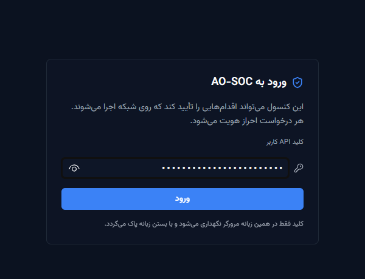

۱. نشانی داشبورد را باز کنید.\
۲. **کلید API کاربر** خود را در کادر وارد کنید.\
۳. روی **ورود** کلیک کنید.

کلید **فقط در همین زبانهٔ مرورگر** نگهداری می‌شود. با بستن زبانه از سامانه خارج می‌شوید، پس رایانهٔ مشترک مرکز عملیات برای شیفت بعد واردشده نمی‌ماند. اگر کلید نادرست یا باطل‌شده باشد، صفحهٔ ورود دوباره نمایش داده می‌شود.

---

## ۴. چیدمان صفحه و نوار بالا

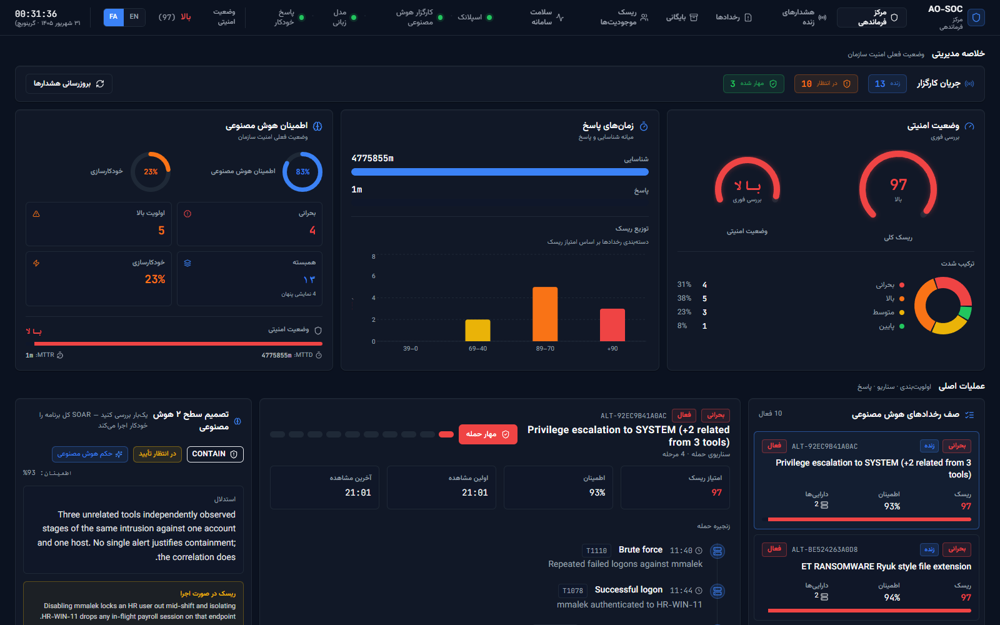

همهٔ صفحه‌ها **نوار بالای** یکسانی دارند. در رابط فارسی، نوار از راست به چپ چیده می‌شود:

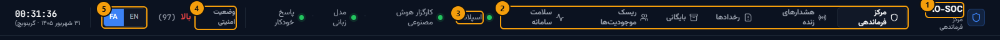

| شماره | بخش | کاربرد |
|---|---|---|
| ۱ | **نشان AO-SOC** | بازگشت به مرکز فرماندهی |
| ۲ | **منوی اصلی** | شش صفحهٔ سامانه (جدول زیر) |
| ۳ | **وضعیت خط لوله** (اسپلانک · کارگزار هوش مصنوعی · مدل زبانی · پاسخ خودکار) | نقطهٔ سبز یعنی آنلاین، کهربایی یعنی تضعیف‌شده، قرمز یعنی آفلاین و خاکستری یعنی نامشخص. هر ۵ ثانیه به‌روز می‌شود |
| ۴ | **وضعیت امنیتی** | وضعیت کلی امنیت (پایین / محافظت‌شده / افزایش‌یافته / بالا) با امتیاز ۰ تا ۱۰۰ |
| ۵ | **EN / FA** | تغییر زبان میان انگلیسی و فارسی |
| – | **ساعت** | ساعت و تاریخ محلی (خورشیدی در رابط فارسی) |

**منوی اصلی**

| گزینهٔ منو | صفحه | برای اینکه… |
|---|---|---|
| **مرکز فرماندهی** | `/` | همه‌چیز را یک‌جا ببینید و روی رخدادها کار کنید. صفحهٔ اصلی شماست |
| **هشدارهای زنده** | `/alerts` | گزارش خام هشدارها را مرور کنید و راهنمای مهار هر هشدار را ببینید |
| **رخدادها** | `/incidents` | فهرست کامل رخدادهای فعال را ببینید و هر کدام را با جزئیات باز کنید |
| **بایگانی** | `/archive` | رخدادهای بسته‌شده را مرور کنید: چه تصمیمی گرفته شد، چه کسی تأیید کرد، چه اجرا شد |
| **ریسک موجودیت‌ها** | `/entities` | پرریسک‌ترین کاربران، میزبان‌ها و نشانی‌های IP را ببینید |
| **سلامت سامانه** | `/health` | زنده بودن خط لوله و داده‌های پایش آن را بررسی کنید |

**پانویس** صفحه نسخهٔ برنامه (مثلاً `v2.8.9`) و مسیر خط لوله را نشان می‌دهد. هنگام گزارش اشکال، نسخه را ذکر کنید.

---

## ۵. مرکز فرماندهی (صفحهٔ اصلی)

مرکز فرماندهی از بالا به پایین به پنج پرسش پاسخ می‌دهد: *اکنون چه چیزی نیاز به توجه دارد؟ چقدر جدی است؟ چرا هوش مصنوعی چنین فکر می‌کند؟ چه باید کرد؟ وضعیت امنیتی ما چیست؟* این صفحه شش ردیف دارد.

### ۵٫۱ خلاصهٔ مدیریتی: «الان وضع چطور است؟»

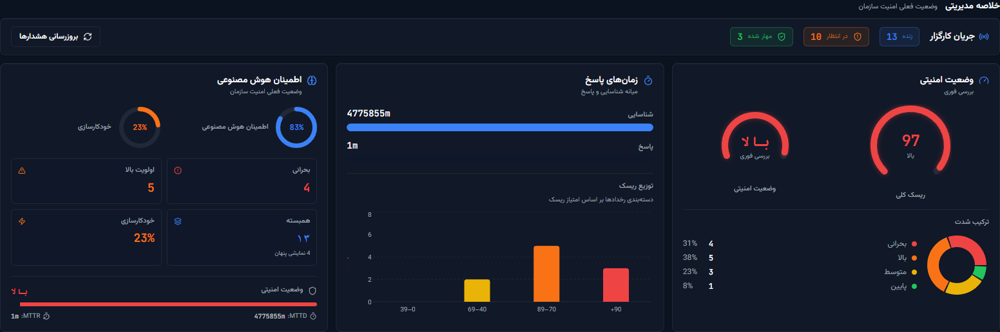

- **جریان کارگزار.** شمار رخدادهای **زنده**، رخدادهای **در انتظار** تصمیم انسانی و رخدادهای **مهار شده**. دکمهٔ **بروزرسانی هشدارها** بی‌درنگ آن‌ها را از نو بارگذاری می‌کند؛ صفحه هر ۱۵ ثانیه خودش هم به‌روز می‌شود.
- **وضعیت امنیتی.** شاخص ریسک کلی (۰ تا ۱۰۰) با برچسب آن و نمودار دایره‌ای **ترکیب شدت** رخدادهای باز.
- **زمان‌های پاسخ.** **MTTD** (میانگین زمان شناسایی) و **MTTR** (میانگین زمان پاسخ)، به‌همراه نمودار **توزیع ریسک** رخدادها بر اساس امتیاز.
- **اطمینان هوش مصنوعی.** میانگین اطمینان مدل، نرخ خودکارسازی و شمار رخدادهای **بحرانی**، **اولویت بالا** و **همبسته**.

> **اطمینان هوش مصنوعی نمایش داده می‌شود، اما هرگز مبنای تصمیم نیست.** مدل‌های محلی تقریباً برای هر ورودی ۷۵ تا ۹۸ درصد اطمینان گزارش می‌کنند. از این عدد برای مرتب‌کردن کارها استفاده کنید، نه به‌عنوان دلیل تأیید.

### ۵٫۲ عملیات اصلی: اولویت‌بندی، سناریو و پاسخ

کار روی رخدادها در این بخش انجام می‌شود.

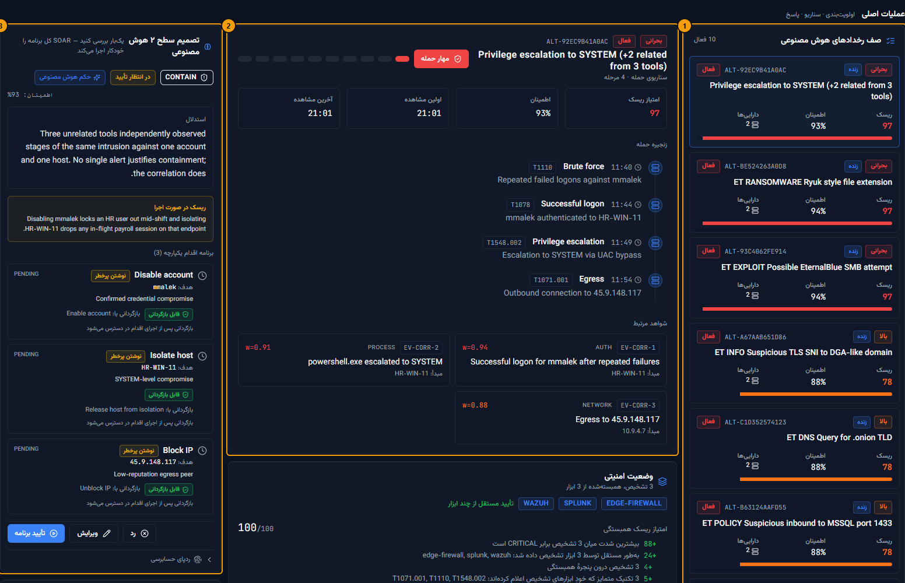

| شماره | پنل | آنچه نشان می‌دهد |
|---|---|---|
| ۱ | **صف رخدادهای هوش مصنوعی** (سمت راست) | رخدادهای فعال، فوری‌ترین در بالا. روی یکی کلیک کنید تا انتخاب شود؛ همهٔ پنل‌های کناری سپس همان رخداد را نشان می‌دهند |
| ۲ | **سناریوی حمله** و پنل‌های زیر آن (وسط) | چه اتفاقی افتاد، به ترتیب زمانی، و شواهد پشت آن |
| ۳ | **تصمیم سطح ۲ هوش مصنوعی** و **اقدامات پیشنهادی هوش مصنوعی** (سمت چپ) | آنچه هوش مصنوعی پیشنهاد می‌دهد و دکمه‌هایی که با آن‌ها اقدام می‌کنید (بخش ۶) |

#### صف رخدادهای هوش مصنوعی

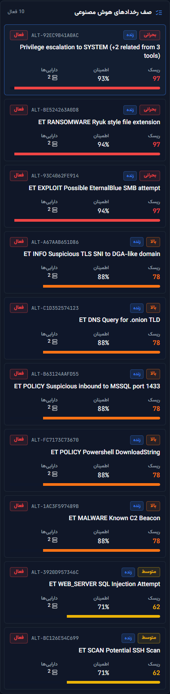

هر کارت نشان می‌دهد: **شدت** (بحرانی، بالا، متوسط، پایین)، نشان **زنده** (دادهٔ واقعی کارگزار؛ نشان **نمایشی** یعنی دادهٔ نمونه)، شناسهٔ رخداد، **وضعیت**، عنوان، امتیاز **ریسک**، **اطمینان** هوش مصنوعی و شمار **دارایی‌های** درگیر. نوار پایین کارت همان امتیاز ریسک است که با رنگ شدت نمایش داده می‌شود.

عنوانی مانند *«Privilege escalation to SYSTEM (+2 related from 3 tools)»* یعنی AO-SOC سه تشخیص از سه ابزار متفاوت را در یک وضعیت واحد به هم پیوند داده است.

#### سناریوی حمله

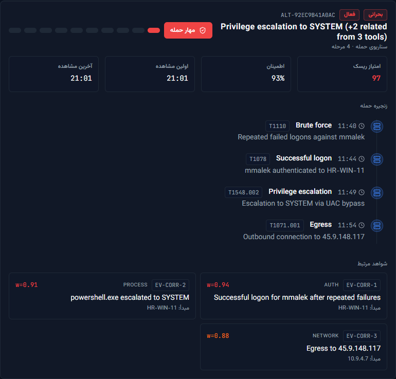

- ردیف بالا: **امتیاز ریسک**، **اطمینان**، **اولین مشاهده** و **آخرین مشاهده**.
- **زنجیره حمله.** هر مرحلهٔ حمله به ترتیب زمانی، با شناسهٔ تکنیک MITRE ATT&CK (مثلاً `T1110` برای Brute force).
- **شواهد مرتبط.** تک‌تک شواهد، نوع آن‌ها (احراز هویت، فرایند، شبکه) و وزنشان.
- **مهار حمله** (دکمهٔ قرمز). رخداد را دستی **مهار شده** علامت می‌زند، **بدون** اجرای برنامه. فقط وقتی از آن استفاده کنید که تهدید بیرون از AO-SOC مهار شده باشد. راه عادی، **تأیید برنامه** است (بخش ۶).

#### وضعیت امنیتی: چرا چند هشدار یک رخداد شدند

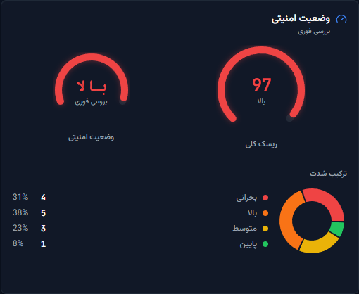

> توجه: در رابط فارسی، عنوان این پنل و برچسب «وضعیت امنیتی» در نوار بالا یکسان است. پنل دربارهٔ **تشخیص‌های همبسته** است و برچسب نوار بالا دربارهٔ **وضعیت کلی امنیت** سازمان.

- **نشان‌های ابزار** (مثلاً `EDGE-FIREWALL`، `SPLUNK`، `WAZUH`) ابزارهایی را نام می‌برند که آن را گزارش کرده‌اند. **تأیید مستقل از چند ابزار** یعنی بیش از یک ابزار آن را دیده است.
- **امتیاز ریسک همبستگی.** محاسبه را سطر به سطر نشان می‌دهد: امتیاز بیشترین شدت، همبستگی میان ابزارها، شمار تشخیص‌ها و شمار تکنیک‌ها. این امتیاز شمارشی از واقعیت‌هاست، نه نظر هوش مصنوعی.
- **همبسته بر اساس.** کاربران، نشانی‌ها، میزبان‌ها و فرایندهای مشترکی که تشخیص‌ها را به هم پیوند داده‌اند.
- **تشخیص‌های عضو.** همهٔ تشخیص‌های اصلی. روی `<` کلیک کنید تا یکی باز شود و موجودیت‌ها، تکنیک‌ها و پیوند بازگشت به ابزار مبدأ آن را ببینید.

#### راستی‌آزمایی و سابقه

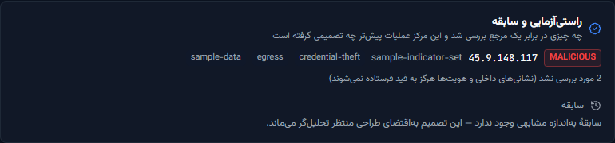

- **نشانه‌هایی که در برابر هوش تهدید بررسی شدند.** نشان `MALICIOUS` یعنی نشانه در یک فید آمده است. «بررسی شد و یافت نشد» دلیل بی‌خطر بودن **نیست**. «بررسی نشد» شامل نشانی‌های داخلی و هویت‌هاست که هرگز به فید فرستاده نمی‌شوند.
- **سابقه.** تصمیم‌های پیشین همین مرکز عملیات در موارد مشابه. پیام «سابقهٔ به‌اندازه مشابهی وجود ندارد» یعنی این رخداد به‌اقتضای طراحی منتظر تحلیل‌گر می‌ماند.

> پنل خالی به معنای نتیجهٔ پاک نیست. اگر هیچ فید هوش تهدیدی پیکربندی نشده باشد، پنل همین را صریح می‌گوید.

#### پرونده: چه کسی مسئول این رخداد است

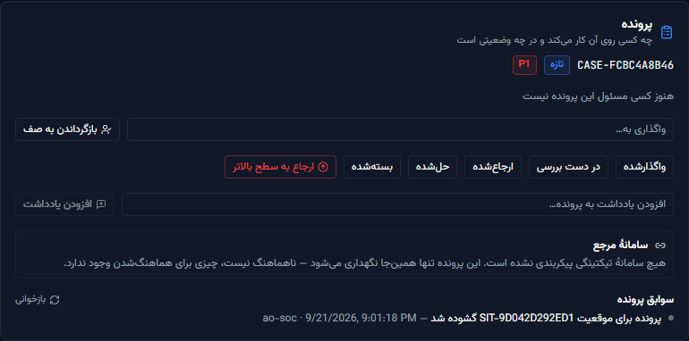

- **شناسهٔ پرونده**، **وضعیت** و **اولویت** آن (`P1` بالاترین اولویت است).
- **واگذاری به…** نامی بنویسید و **واگذاری** را بزنید. **بازگرداندن به صف** مسئول پرونده را برمی‌دارد.
- **دکمه‌های وضعیت** پرونده را در چرخهٔ عمرش پیش می‌برند:
  تازه ← واگذارشده ← در دست بررسی ← ارجاع‌شده ← حل‌شده ← بسته‌شده، و از حل‌شده یا بسته‌شده به بازگشایی‌شده. فقط وضعیت‌های مجاز بعدی نمایش داده می‌شوند.
- **ارجاع به سطح بالاتر** پرونده را به سطح بعدی می‌فرستد.
- **افزودن یادداشت** در **سوابق پرونده** می‌نویسد؛ سوابق پرونده بعداً قابل ویرایش نیست.
- **سامانهٔ مرجع.** نشان می‌دهد پرونده با سامانهٔ تیکتینگ (مثلاً TheHive) همگام است یا نه. پیام «هیچ سامانهٔ تیکتینگی پیکربندی نشده است» یک وضعیت عادی است، نه خطا.

> هیچ‌چیز در پنل پرونده نمی‌تواند تصمیمی را تأیید یا رد کند. مسئولیت پرونده و تصمیم دربارهٔ آن عمداً از هم جدا نگه داشته شده‌اند.

#### اقدامات پیشنهادی هوش مصنوعی

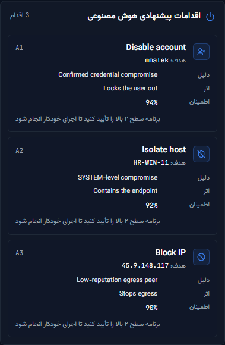

همان اقدام‌های برنامه، هر کدام با **هدف**، **دلیل**، **اثر** و **اطمینان**. برای رخدادهای زنده این‌ها را یکی‌یکی اجرا نمی‌کنید. پیام «برنامه سطح ۲ بالا را تأیید کنید تا اجرای خودکار انجام شود» یعنی از **تأیید برنامه** استفاده کنید.

### ۵٫۳ تحلیل ریسک

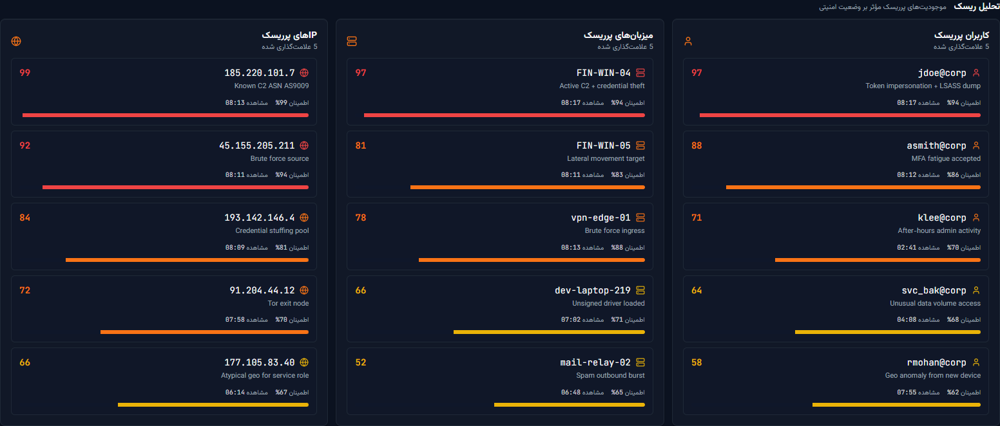

پرریسک‌ترین **کاربران**، **میزبان‌ها** و **نشانی‌های IP** که بر وضعیت امنیتی کنونی اثر دارند. فهرست کامل و قابل جست‌وجو در صفحهٔ **ریسک موجودیت‌ها** است (بخش ۱۰).

### ۵٫۴ MITRE ATT&CK

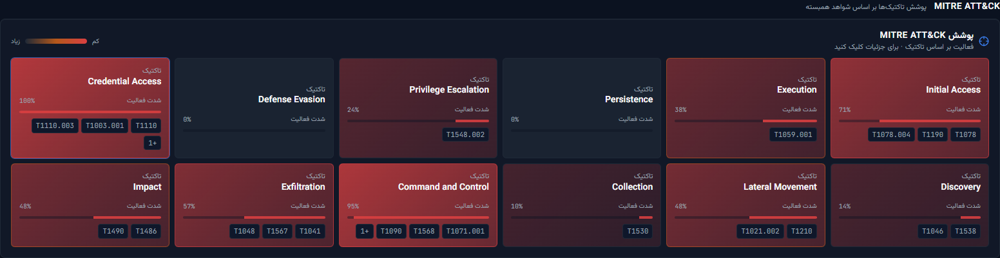

فعالیت بر اساس **تاکتیک** ATT&CK. خانه‌های قرمزتر یعنی شدت فعالیت بیشتر. هر خانه شناسهٔ تکنیک‌های دیده‌شده را فهرست می‌کند؛ برای جزئیات روی خانه کلیک کنید. تکنیک‌ها با یک فهرست محلی ATT&CK سنجیده می‌شوند و شناسه‌ای که در فهرست نیست «فهرست‌نشده» علامت می‌خورد و به‌عنوان واقعیت نمایش داده نمی‌شود.

### ۵٫۵ توضیح هوش مصنوعی

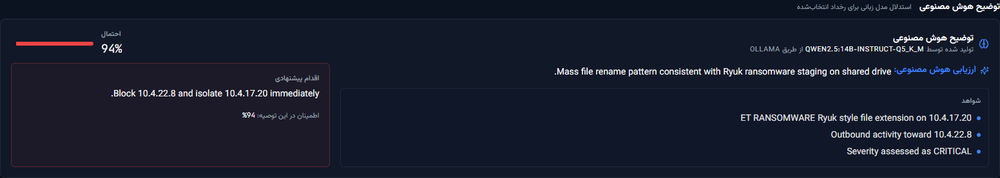

استدلال مدل محلی برای رخداد انتخاب‌شده: **ارزیابی**، **شواهدی** که بر آن تکیه کرده، **اقدام پیشنهادی** و **احتمال**. پنل نام مدلی را هم که آن را نوشته نشان می‌دهد (مثلاً `qwen2.5:14b-instruct` از طریق Ollama).

### ۵٫۶ سلامت سامانه (پنل)

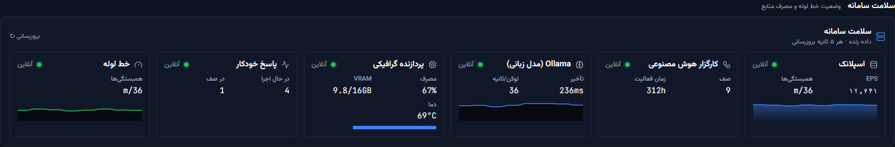

نسخهٔ فشردهٔ صفحهٔ سلامت سامانه (بخش ۱۱).

---

## ۶. کار روی یک رخداد: تصمیم سطح ۲ هوش مصنوعی

این پنل قلب AO-SOC است. شما **یک‌بار بررسی می‌کنید** و ابزارهای پاسخ سپس کل برنامه را اجرا می‌کنند.

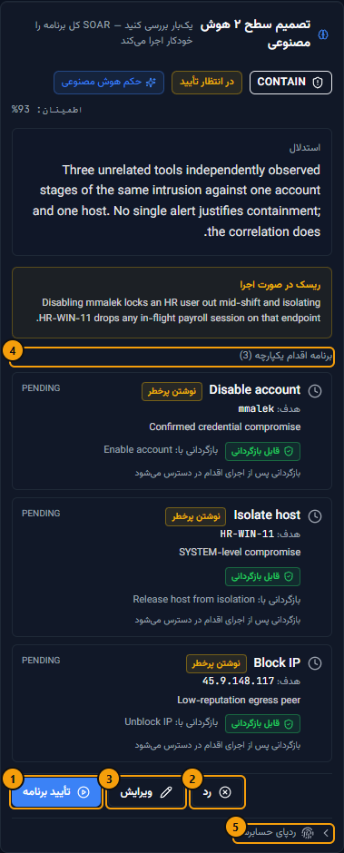

**خواندن پنل از بالا به پایین**

- **حکم**: `CONTAIN` (مهار)، `ESCALATE` (ارجاع)، `INVESTIGATE` (بررسی)، `MONITOR` (پایش) یا `IGNORE` (نادیده‌گرفتن).
- **وضعیت**: در انتظار تأیید ← تأیید شده ← در حال اجرا ← تکمیل. وضعیت‌های ممکن دیگر: رد شده، ناموفق، اجرای آزمایشی، جایگزین‌شده.
- **چه کسی تصمیم گرفت**:
  - **حکم هوش مصنوعی**: تصمیم را مدل داده است.
  - **بازگشت به قاعده**: مدل پاسخ قابل استفاده‌ای نداد و یک قاعدهٔ مبتنی بر شدت تصمیم گرفت. این موارد را با دقت بیشتری بخوانید.
  - **اصلاح تحلیل‌گر**: یک انسان آن را ویرایش کرده است.
- **استدلال**: دلیل تصمیم، به زبان ساده.
- **ریسک در صورت اجرا** (کادر کهربایی): اجرای برنامه چه چیزی را ممکن است مختل کند؛ مثلاً غیرفعال‌شدن حساب یک کاربر منابع انسانی در میانهٔ شیفت.
- **(۴) برنامه اقدام یکپارچه**: هر اقدام با:
  - **هدف** آن (نشانی IP، میزبان یا حساب) و دلیل،
  - **ردهٔ خطر**: فقط خواندن، نوشتن کم‌خطر، نوشتن پرخطر یا مخرب،
  - **بازگشت‌پذیری**: **قابل بازگردانی** (با نام اقدام بازگرداننده)، **بازگشت‌ناپذیر** یا **چیزی برای بازگرداندن نیست**،
  - نشان محافظ در صورت لزوم: **دارایی حیاتی**، **حساب دارای دسترسی ویژه** یا **حساب سرویس**. خلبان خودکار هرگز این‌ها را اجرا نمی‌کند؛ باید یک انسان تأیید کند.
- **دکمه‌ها**: **(۱) تأیید برنامه**، **(۲) رد**، **(۳) ویرایش**.
- **(۵) ردپای حسابرسی**: تصمیم چگونه ساخته شد (بخش ۶٫۴).

### ۶٫۱ تأیید برنامه

۱. **استدلال**، پنل **وضعیت امنیتی** و کادر **ریسک در صورت اجرا** را بخوانید.\
۲. **هدف** هر اقدام را بررسی کنید: آیا میزبان، حساب یا نشانی درست است؟\
۳. روی **تأیید برنامه** کلیک کنید.

همهٔ اقدام‌ها در صف قرار می‌گیرند و خودکار اجرا می‌شوند. وضعیت هر اقدام از `PENDING` به `EXECUTING` و سپس `DONE` تغییر می‌کند. وقتی همه موفق شوند، رخداد **بسته می‌شود**: از صف خارج می‌شود، به **بایگانی** می‌رود و یک نوار سبز آن را اعلام می‌کند.

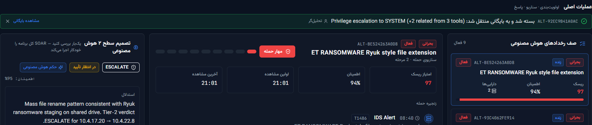

روی **مشاهده بایگانی** کلیک کنید تا آن را ببینید، یا با **✕** نوار را ببندید.

> **اجرای آزمایشی.** وقتی استقرار با `RESPONSE_DRY_RUN=true` اجرا می‌شود، اقدام‌ها به‌جای «تکمیل» وضعیت **اجرای آزمایشی** (کهربایی) می‌گیرند: «چیزی به هیچ مجری ارسال نشد». رخداد **مهار شده** علامت نمی‌خورد. این عمدی است؛ مهار شبیه‌سازی‌شده هرگز نباید شبیه مهار واقعی دیده شود.

### ۶٫۲ ویرایش برنامه (اصلاح هوش مصنوعی)

وقتی هوش مصنوعی *تا حدی* درست گفته از **ویرایش** استفاده کنید: حکم اشتباه است، هدفی اشتباه است، یا اقدامی کم یا زیاد است.

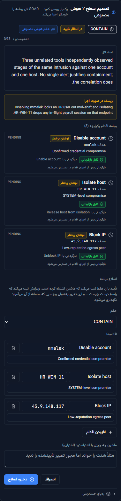

۱. روی **ویرایش** کلیک کنید.\
۲. در صورت نیاز **حکم** را تغییر دهید.\
۳. نام، هدف یا دلیل هر اقدام را تغییر دهید. **افزودن اقدام** یک سطر اضافه می‌کند و نماد سطل زباله یک سطر را حذف می‌کند.\
۴. در صورت تمایل بنویسید **ماشین چه چیزی را اشتباه دید**؛ مثلاً «مجوز تغییر تأییدشده را ندید».\
۵. روی **ذخیره اصلاح** کلیک کنید و سپس برنامهٔ اصلاح‌شده را تأیید کنید.

اصلاح شما به‌عنوان **برچسبی** ذخیره می‌شود که سامانه از آن می‌آموزد و به *سابقه‌ای* تبدیل می‌شود که تصمیم‌های بعدی با آن سنجیده می‌شوند. ویرایش راه بهترشدن سامانه است؛ پس یک ویرایش از یک رد بی‌توضیح مفیدتر است.

AO-SOC ویرایشی را که هرگز قابل اجرا نباشد نمی‌پذیرد؛ مثلاً اقدام *Block IP* با هدفی که نشانی IP نیست. برنامه‌ای که اجرا شده دیگر ویرایش‌پذیر نیست، چون سند آن چیزی است که فرستاده شد.

### ۶٫۳ رد برنامه

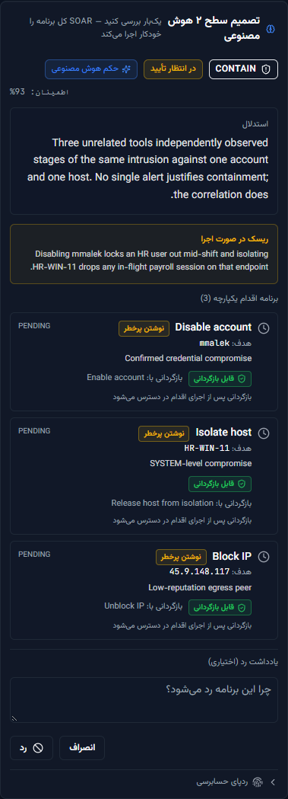

۱. روی **رد** کلیک کنید.\
۲. در صورت تمایل **دلیل** را در یادداشت رد بنویسید.\
۳. با زدن دوبارهٔ **رد** تأیید کنید.

چیزی اجرا نمی‌شود. وقتی هیچ اقدامی لازم نیست از رد استفاده کنید؛ مثلاً برای یک اسکنر مجاز یا یک مثبت کاذب شناخته‌شده.

### ۶٫۴ ردپای حسابرسی

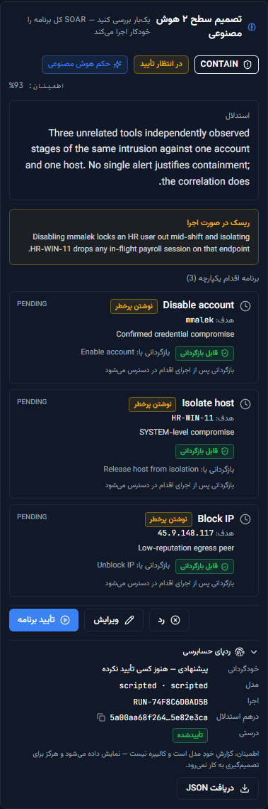

روی **ردپای حسابرسی** کلیک کنید تا باز شود. این بخش نشان می‌دهد:

- **خودگردانی**: *پیشنهادی* (هنوز کسی تأیید نکرده)، *زیر نظارت* (یک انسان تأیید کرده) یا *خودکار* (خلبان خودکار بر پایهٔ سابقه تأیید کرده).
- **مدل** و **اجرا**: کدام مدل تصمیم را ساخت و شناسهٔ آن اجرا.
- **درهمِ استدلال** (با دکمهٔ رونوشت) و **درستی**: «تأییدشده» یعنی پرسش و پاسخ ذخیره‌شده هنوز با درهم خود می‌خوانند؛ «ناهمخوان» یعنی رکورد دستکاری شده است.
- **دریافت JSON**: پروندهٔ کامل تصمیم (وضعیت، تصمیم، اقدام‌ها و ردپای حسابرسی) برای گزارش یا مستندسازی شواهد.

### ۶٫۵ ثبت آنچه در عمل رخ داد

پس از قطعی‌شدن تصمیم، پنل می‌پرسد **در عمل چه شد** و تا ۷۲ ساعت (قابل تنظیم) می‌توانید پاسخ دهید:

- **مثبت درست**: حملهٔ واقعی بود.
- **مثبت کاذب**: حمله نبود.
- **بازگشایی‌شده**: دوباره تکرار شد.

لطفاً نتیجه را ثبت کنید. همین پاسخ‌ها تعیین می‌کنند کدام منابع تشخیص و کدام حکم‌ها آن‌قدر قابل اعتمادند که روزی خودکار شوند.

### ۶٫۶ خلبان خودکار (در صورت فعال بودن)

اگر خلبان خودکار در سازمان فعال شده باشد، برخی تصمیم‌ها **بدون** کلیک اجرا می‌شوند. این کار فقط زمانی انجام می‌شود که **به اندازهٔ کافی موارد مشابه پیشین با همان حکم توسط انسان تأیید شده باشند، هیچ‌کدام برگردانده نشده باشد و جدیدترینشان تازه باشد**. خلبان خودکار **هرگز** این‌ها را خودکار انجام نمی‌دهد:

- اقدام روی **دارایی حیاتی** (کنترل‌کننده‌های دامنه، پایگاه‌های داده و هر آنچه سازمان فهرست کرده)،
- غیرفعال‌کردن یا بازنشانی **حساب دارای دسترسی ویژه** یا **حساب سرویس**،
- اقدامی که **بازگشت‌ناپذیر** است،
- اقدام **مخرب**.

در بایگانی، رخدادهایی که خلبان خودکار بسته، به‌جای نشان **تحلیل‌گر** نشان **خلبان خودکار** دارند.

---

## ۷. هشدارهای زنده و راهنمای رخداد

**منو: هشدارهای زنده.** گزارش خام هشدارهای کارگزار، برای مرور سریع.

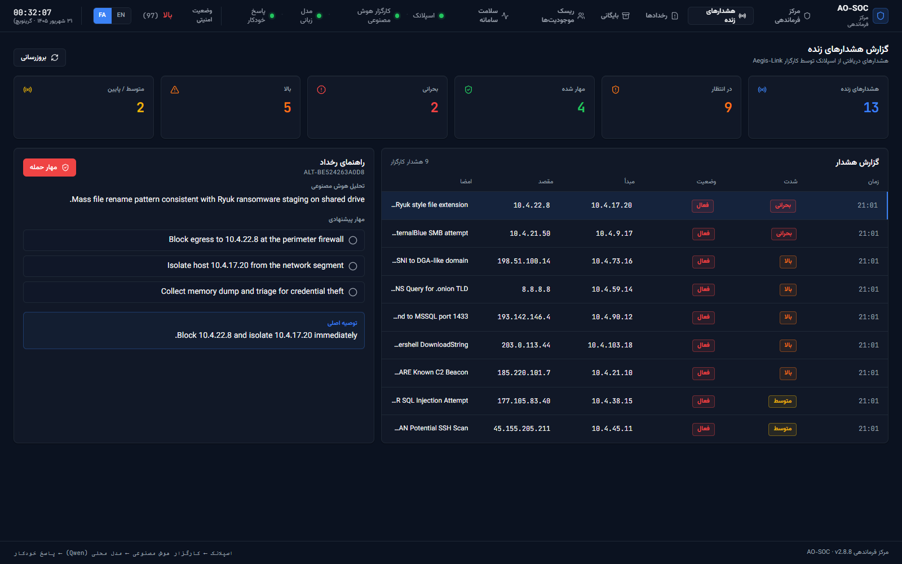

- **کاشی‌های بالا**: شمار **هشدارهای زنده**، **در انتظار**، **مهار شده**، **بحرانی**، **بالا** و **متوسط / پایین**.
- **گزارش هشدار**: زمان، شدت، وضعیت، نشانی مبدأ و مقصد و امضا. **بروزرسانی** گزارش را از نو بارگذاری می‌کند.

**روی یک هشدار کلیک کنید** تا **راهنمای رخداد** آن در کنار صفحه باز شود:

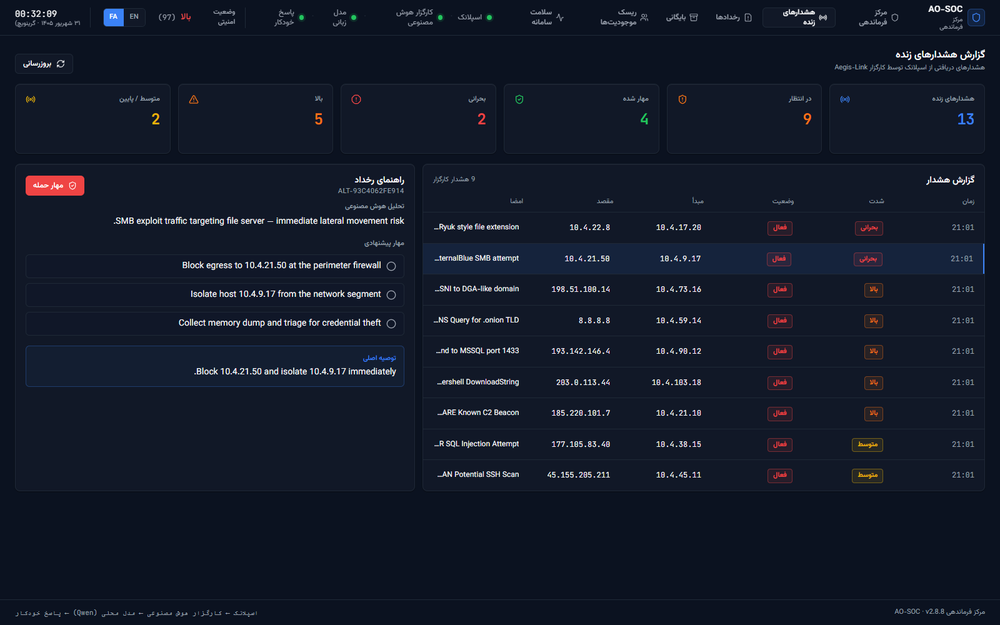

- **تحلیل هوش مصنوعی**: خلاصه‌ای یک‌خطی.
- **مهار پیشنهادی**: مراحل راهنما به شکل فهرست بررسی. هر مرحله پس از انجام، سبز و تیک‌خورده می‌شود.
- **توصیه اصلی**: مهم‌ترین گام.
- **مهار حمله**: هشدار را دستی مهار شده علامت می‌زند (بخش ۵٫۲ را ببینید).

برای **تأیید و اجرای** راهنما، رخداد را در **مرکز فرماندهی** یا در **صفحهٔ جزئیات** آن باز کنید و از **تأیید برنامه** استفاده کنید (بخش ۶).

---

## ۸. فهرست رخدادها و جزئیات رخداد

### ۸٫۱ رخدادها

**منو: رخدادها.** همهٔ رخدادهای فعال در یک جدول.

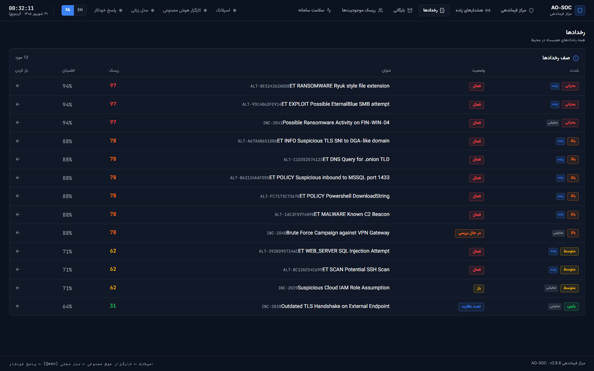

ستون‌ها: شدت، وضعیت (با نشان **زنده** یا **نمایشی**)، عنوان، **ریسک**، **اطمینان** هوش مصنوعی و **باز کردن**. روی یک سطر کلیک کنید تا صفحهٔ جزئیات آن باز شود.

### ۸٫۲ جزئیات رخداد

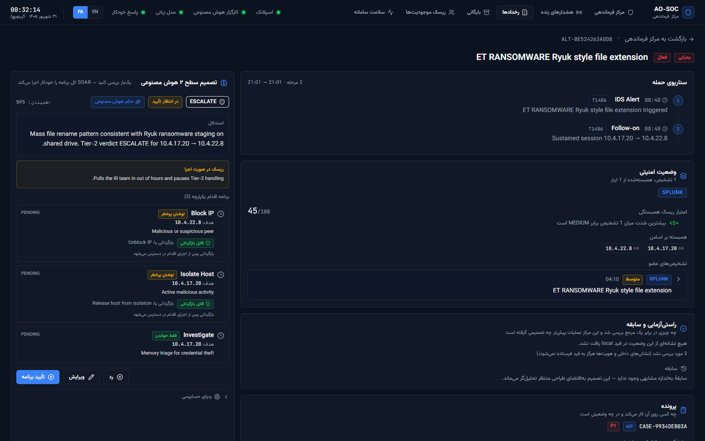

برای هر رخداد یک صفحه، با همه‌چیز در یک‌جا:

- پیوند **بازگشت به مرکز فرماندهی**، شناسه، شدت، وضعیت و عنوان رخداد.
- **ستون راست**: **سناریوی حمله**، **وضعیت امنیتی**، **راستی‌آزمایی و سابقه**، **پرونده** و **توضیح هوش مصنوعی**.
- **ستون چپ**: **تصمیم سطح ۲ هوش مصنوعی** (با همهٔ دکمه‌ها)، **دارایی‌های متأثر**، **تکنیک‌های MITRE** و **اقدامات پیشنهادی هوش مصنوعی**.

از این صفحه وقتی استفاده کنید که می‌خواهید پیوند یک رخداد را به اشتراک بگذارید، یا اقدامی را روی رخدادی که مهار شده **بازگردانی** کنید (بخش ۹٫۲).

---

## ۹. بایگانی و بازگردانی اقدام‌ها

### ۹٫۱ بایگانی

**منو: بایگانی.** رخدادهای بسته‌شده، جدیدترین در بالا.

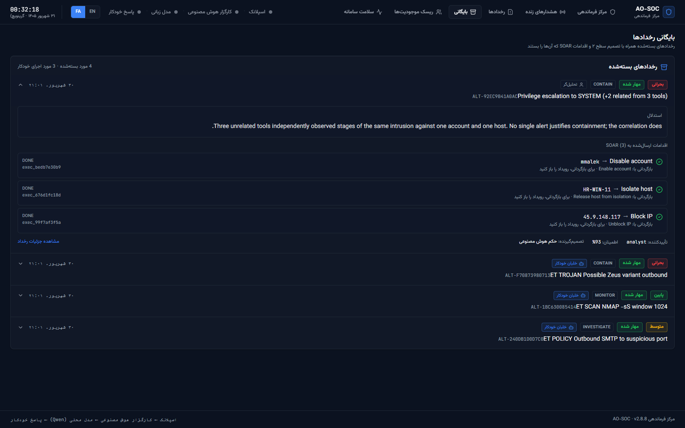

- سرآیند، شمار رخدادهای **بسته‌شده** و شمار موارد **اجرای خودکار** را نشان می‌دهد.
- هر سطر: شدت، **مهار شده**، حکم، و **تحلیل‌گر** یا **خلبان خودکار** یعنی تأییدکننده.
- **روی یک سطر کلیک کنید** تا **استدلال**، همهٔ **اقدامات ارسال‌شده به SOAR** با وضعیت و شناسهٔ اجرا، تأییدکننده، اطمینان و منبع تصمیم را ببینید.
- **مشاهده جزئیات رخداد** صفحهٔ کامل رخداد را باز می‌کند.

### ۹٫۲ بازگردانی یک اقدام

هر اقدامی که **قابل بازگردانی** باشد، پس از اجرا قابل پس‌گرفتن است. برای نمونه، *Block IP* با *Unblock IP* بازگردانده می‌شود.

۱. در بایگانی روی **مشاهده جزئیات رخداد** کلیک کنید. اگر رخداد هنوز فعال است، از مرکز فرماندهی هم می‌توانید.\
۲. در پنل تصمیم سطح ۲ هوش مصنوعی، اقدام را پیدا کنید و روی **بازگردانی** کلیک کنید.

   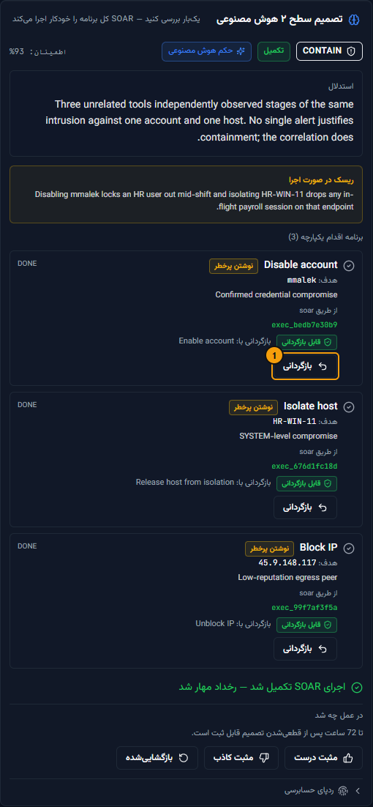

۳. در صورت تمایل **دلیل** را بنویسید؛ مثلاً «پنجرهٔ تغییر CHG-2211 این ترافیک را تأیید کرده بود».\
۴. برای تأیید، دوباره روی **بازگردانی** کلیک کنید.

   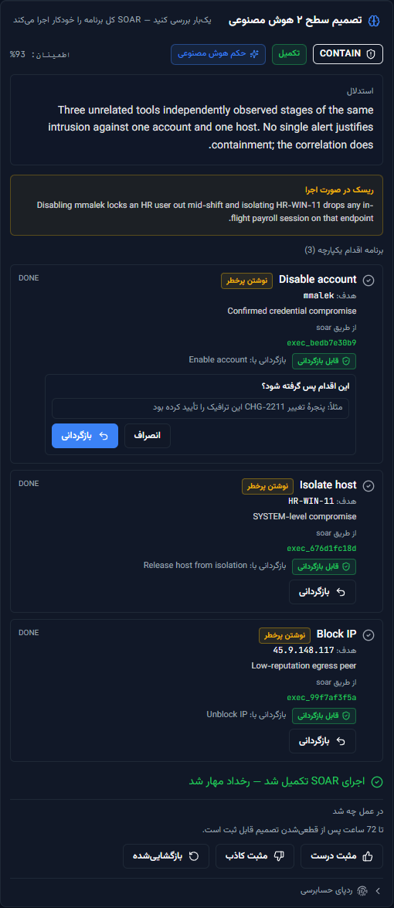

اقدام بازگرداننده از همان مسیر اقدام اصلی فرستاده می‌شود. سپس اقدام وضعیت «توسط *نام شما* بازگردانده شد» می‌گیرد و رخداد به‌جای اینکه «مهار شده» بماند **بازگشایی** می‌شود. سوابق پرونده ثبت می‌کند چه کسی چه چیزی را بازگرداند.

- دکمهٔ **بازگردانی** فقط **پس از** اجرای اقدام نمایش داده می‌شود.
- اقدام **بازگشت‌ناپذیر** دکمهٔ بازگردانی ندارد.
- پیام «مجری بازگردانی را نپذیرفت» یعنی ابزار پاسخ فرمان بازگرداننده‌ای ندارد. اقدام را مستقیماً در همان ابزار برگردانید.

---

## ۱۰. ریسک موجودیت‌ها

**منو: ریسک موجودیت‌ها.** موجودیت‌های با بالاترین امتیاز ریسک در کل محیط.

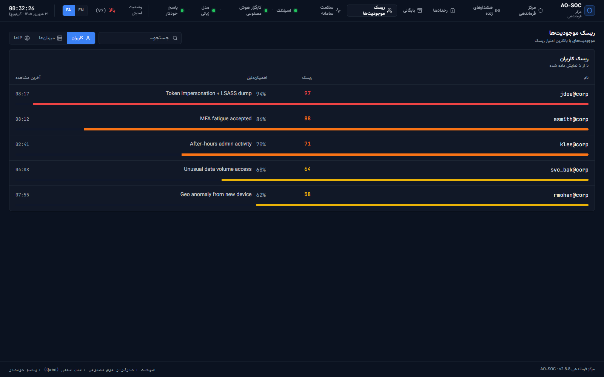

- با زبانه‌های **کاربران**، **میزبان‌ها** و **IPها** میان فهرست‌ها جابه‌جا شوید.
- کادر **جستجو…** فهرست را هم‌زمان با تایپ پالایش می‌کند.
- هر سطر: نام، امتیاز **ریسک** (با نوار رنگی)، **اطمینان** مدل، **دلیل** و **آخرین مشاهده**.

از این صفحه برای پاسخ به این پرسش استفاده کنید: «اکنون چه کسی یا چه چیزی بیشترین ریسک را دارد؟» و نیز برای اینکه ببینید حساب یا میزبان یک رخداد سابقه‌ای دارد یا نه.

---

## ۱۱. سلامت سامانه

**منو: سلامت سامانه.** آیا خط لوله زنده است؟

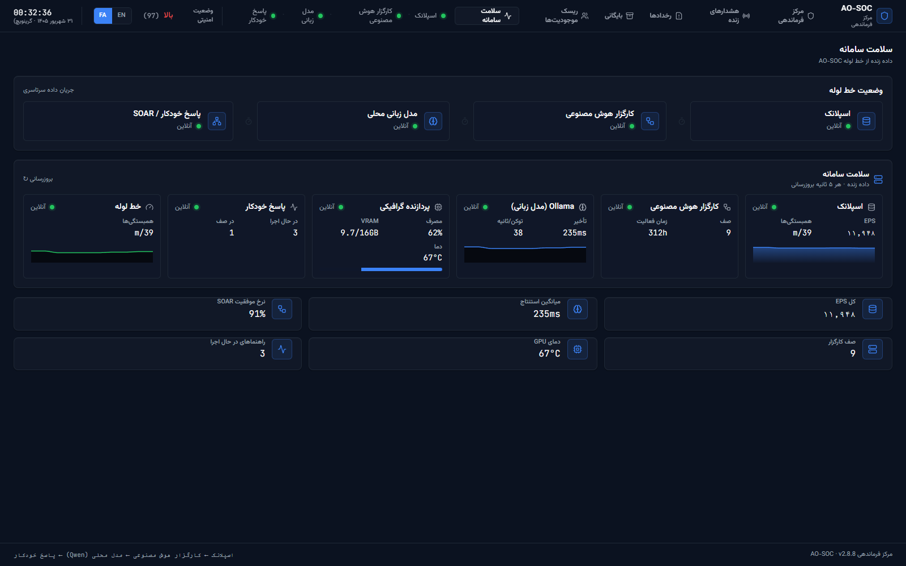

- **وضعیت خط لوله**: **اسپلانک ← کارگزار هوش مصنوعی ← مدل زبانی محلی ← پاسخ خودکار / SOAR**، هر کدام آنلاین، تضعیف‌شده، آفلاین یا نامشخص.
- **دادهٔ زنده** (هر ۵ ثانیه): رویداد در ثانیه و همبستگی‌ها (اسپلانک)، طول صف و زمان فعالیت (کارگزار)، تأخیر و توکن در ثانیه (مدل)، مصرف، VRAM و دمای پردازندهٔ گرافیکی، و اقدام‌های در حال اجرا و در صف (SOAR).
- **کاشی‌های خلاصه**: کل EPS، میانگین استنتاج، نرخ موفقیت SOAR، صف کارگزار، دمای GPU و راهنماهای در حال اجرا.

اگر جزئی قرمز یا خاکستری است، بخش ۱۵ را ببینید.

---

## ۱۲. زبان: فارسی و انگلیسی

روی **EN** در نوار بالا کلیک کنید تا رابط انگلیسی شود و روی **FA** برای بازگشت به فارسی. رابط فارسی راست‌به‌چپ است و برچسب‌ها، تاریخ‌ها (خورشیدی) و توضیح عوامل ریسک هم فارسی می‌شوند. انتخاب شما در همین مرورگر به خاطر سپرده می‌شود.

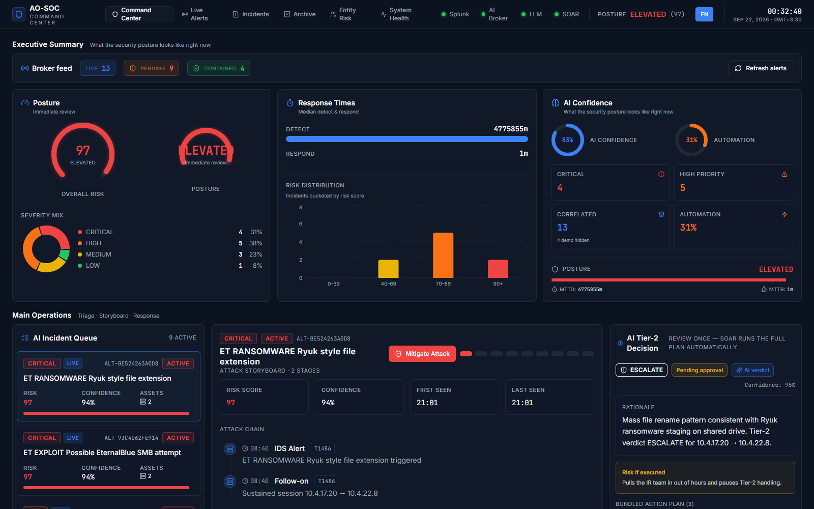

---

## ۱۳. روال روزانه

**آغاز شیفت**

۱. با **کلید خودتان** وارد شوید.\
۲. به نوار بالا نگاه کنید: آیا هر چهار نقطهٔ خط لوله **سبز** است؟ اگر نه، **سلامت سامانه** را باز کنید.\
۳. **خلاصهٔ مدیریتی** را بخوانید: وضعیت امنیتی، شمار رخدادهای **در انتظار** و ترکیب شدت.

**در طول شیفت، برای هر رخداد صف رخدادهای هوش مصنوعی (از بالا)**

۱. **انتخابش کنید.**\
۲. **بخوانید**: سناریوی حمله، سپس **وضعیت امنیتی** (چه چیزی آن را به هم پیوند داده)، سپس **راستی‌آزمایی و سابقه**.\
۳. **مسئولیت را بپذیرید**: در **پرونده** آن را به خودتان واگذار کنید و وضعیت را «در دست بررسی» بگذارید.\
۴. **تصمیم بگیرید**، در پنل تصمیم سطح ۲ هوش مصنوعی:
   - برنامه درست است ← **تأیید برنامه**،
   - برنامه تا حدی اشتباه است ← **ویرایش** و سپس تأیید،
   - نباید چیزی اجرا شود ← **رد**، با یادداشت،
   - به سطح بالاتر نیاز دارد ← **ارجاع به سطح بالاتر** در پنل پرونده.

۵. نکته‌های مفید را در سوابق پرونده **یادداشت کنید**.\
۶. پس از بسته‌شدن، مدخل آن را در **بایگانی** بررسی کنید.

**پایان شیفت**

۱. برای تصمیم‌هایی که امروز قطعی شدند، **مثبت درست / مثبت کاذب / بازگشایی‌شده** را ثبت کنید.\
۲. پرونده‌هایی را که هنوز «در دست بررسی» هستند تحویل دهید: یادداشت بگذارید و دوباره واگذار کنید.\
۳. زبانهٔ مرورگر را ببندید تا از سامانه خارج شوید.

**برای سرپرست شیفت (هفتگی)**: یک پشتیبان بگیرید و درستی آن را بسنجید (بخش ۷ برنامهٔ راه‌اندازی) و بررسی کنید کدام منابع تشخیص مثبت کاذب تولید می‌کنند.

---

## ۱۴. واژه‌نامه: نشان‌ها، رنگ‌ها و وضعیت‌ها

**رنگ شدت**: بحرانی قرمز · بالا نارنجی · متوسط زرد · پایین سبز.

**وضعیت امنیتی**: پایین ← محافظت‌شده ← افزایش‌یافته ← بالا (بدترین).

| اصطلاح | معنا |
|---|---|
| **زنده / نمایشی** | دادهٔ واقعی کارگزار / دادهٔ نمونهٔ داخلی |
| **وضعیت امنیتی (Situation)** | یک یا چند تشخیص، احتمالاً از چند ابزار، دربارهٔ موجودیت‌های یکسان در یک بازهٔ زمانی |
| **تصمیم سطح ۲** | حکم: `CONTAIN` (اکنون مهار کن)، `ESCALATE` (سطح بالاتر یا تیم پاسخ به حادثه را درگیر کن)، `INVESTIGATE` (عمیق‌تر بررسی کن)، `MONITOR` (زیر نظر بگیر)، `IGNORE` (اقدامی لازم نیست) |
| **برنامه اقدام یکپارچه** | راهنما: مجموعهٔ اقدام‌های پیوسته به یک تصمیم که با هم تأیید و اجرا می‌شوند |
| **حکم هوش مصنوعی / بازگشت به قاعده / اصلاح تحلیل‌گر** | اینکه تصمیم را مدل، قاعدهٔ شدت یا یک انسان داده است |
| **فقط خواندن / نوشتن کم‌خطر / نوشتن پرخطر / مخرب** | میزان تغییری که یک اقدام ایجاد می‌کند. اقدام مخرب رد می‌شود مگر اینکه سازمان آگاهانه آن را فعال کرده باشد |
| **قابل بازگردانی / بازگشت‌ناپذیر / چیزی برای بازگرداندن نیست** | اینکه اقدام را می‌توان پس گرفت یا نه |
| **دارایی حیاتی / حساب دارای دسترسی ویژه / حساب سرویس** | هدف‌هایی که خلبان خودکار هرگز به آن‌ها دست نمی‌زند |
| **در انتظار تأیید ← تأیید شده ← در حال اجرا ← تکمیل** | ترتیب عادی وضعیت یک برنامه |
| **ناموفق** | ابزار پاسخ درخواست را دریافت و رد کرد؛ دلیل در رسید آمده است |
| **مسدود (BLOCKED)** | اقدام اصلاً از AO-SOC خارج نشد؛ هدف نادرست بود یا هیچ ابزاری آن را انجام نمی‌دهد |
| **اجرای آزمایشی** | فقط شبیه‌سازی؛ چیزی به هیچ ابزاری فرستاده نشد |
| **جایگزین‌شده** | وضعیت در وضعیت دیگری ادغام شده و تصمیم جاری آنجاست |
| **سابقه** | موارد مشابه پیشین که انسان‌ها درباره‌شان تصمیم گرفته‌اند و خلبان خودکار به آن‌ها تکیه می‌کند |
| **وضعیت‌های پرونده** | تازه، واگذارشده، در دست بررسی، ارجاع‌شده، حل‌شده، بسته‌شده، بازگشایی‌شده |
| **MTTD / MTTR** | میانگین زمان شناسایی / میانگین زمان پاسخ |

---

## ۱۵. رفع اشکال

| نشانه | اقدام |
|---|---|
| صفحهٔ ورود مدام برمی‌گردد | کلید نادرست یا باطل است، یا کلید کارگزار است نه کلید داشبورد. از مدیر سامانه کلیدی از `AOSOC_API_KEYS` بخواهید |
| پیام «بارگذاری داشبورد ناموفق بود … پورت 4317» | API رابط کاربری اجرا نمی‌شود. حالت نمایشی: `start-demo` را دوباره اجرا کنید. Docker: `docker compose -f deploy/docker-compose.yml ps` |
| صف خالی است | بررسی کنید ابزارهای تشخیص با کلید **ingest** به کارگزار می‌فرستند. حالت نمایشی: `start-demo` را دوباره اجرا کنید یا در ویندوز `orchestrator\trigger-alert.ps1` را |
| رخدادهای تازه تصمیم نمی‌گیرند | شاید صف تحلیل کارهای ناموفق دارد. از مدیر سامانه بخواهید `GET /api/queue` را روی کارگزار بررسی کند. تشخیص‌ها در هر حال ذخیره شده‌اند و قابل تکرارند |
| همهٔ تصمیم‌ها **بازگشت به قاعده** هستند | مدل پاسخ نمی‌دهد. نقطهٔ **مدل زبانی** و صفحهٔ سلامت سامانه را ببینید؛ مطمئن شوید Ollama اجراست و مدل دریافت شده است |
| اقدامی **ناموفق** است | ابزار پاسخ آن را نپذیرفت؛ دلیل در رسید تحویل آمده است. مشکل را در همان ابزار رفع کنید یا برنامه را ویرایش کنید |
| اقدامی **مسدود** است | هدف برای آن اقدام معتبر نیست یا هیچ رابطی آن را اجرا نمی‌کند. برنامه را **ویرایش** و هدف را اصلاح کنید |
| همه‌چیز **اجرای آزمایشی** است | استقرار هنوز در حالت آزمایشی است (`RESPONSE_DRY_RUN=true`). تا مرحلهٔ ۲ برنامهٔ راه‌اندازی، این طراحی عمدی است |
| وضعیت پرونده تغییر نمی‌کند | آن جابه‌جایی مجاز نیست. فقط دکمه‌های نمایش‌داده‌شده وضعیت‌های مجاز بعدی‌اند |
| نقطه‌های خط لوله خاکستری (نامشخص) هستند | بررسی سلامت هنوز پاسخ نداده است. ۵ ثانیه صبر کنید یا صفحه را از نو بارگذاری کنید. اگر خاکستری ماند، اجرای کارگزار را بررسی کنید |

هنگام گزارش اشکال، **نسخه** را از پانویس، **شناسهٔ رخداد** (مثلاً `ALT-8AE6D52F8208`) و در صورت امکان فایل **دریافت JSON** از ردپای حسابرسی را همراه کنید.

---

## تاریخچهٔ تغییرات

| نسخه | تاریخ | تغییر | نویسنده |
|---|---|---|---|
| ۱٫۰ | تابستان ۱۴۰۵ | ویرایش نخست برای `ao-soc` نسخهٔ ۲٫۸٫۹: نصب (نمایشی و Docker)، ورود، همهٔ منوها و صفحه‌ها، روند تصمیم سطح ۲ (تأیید، ویرایش، رد، حسابرسی، نتیجه، بازگردانی)، راهنمای رخداد در هشدارهای زنده، روال روزانه، واژه‌نامه و رفع اشکال. ۳۰ تصویر از رابط فارسی محیط نمایشی | J.Ekrami، Claude (Opus 5) |

</div>
