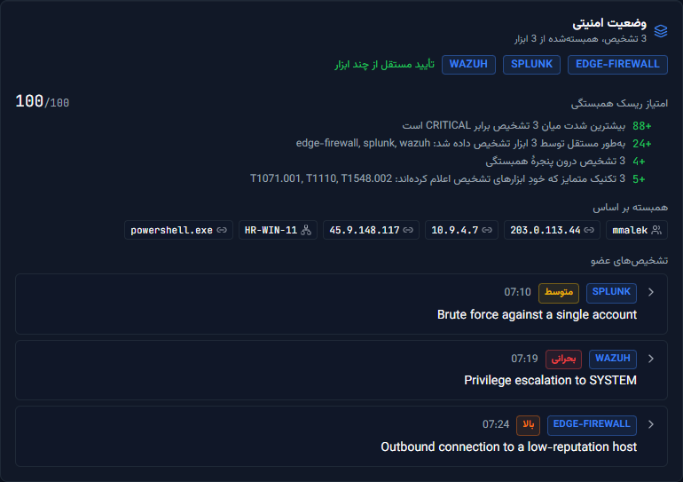

<div dir="rtl">

# راهنمای کاربر مرکز فرماندهی AO-SOC

| | |
|---|---|
| **نویسنده** | J.Ekrami |
| **هم‌نویسنده** | Claude (Opus 5) |
| **حق نشر** | © J.Ekrami-Labs |
| **تاریخ** | تابستان ۱۴۰۵ |
| **نسخهٔ سند** | ۲٫۰ |
| **برای** | `ao-soc` نسخهٔ ۲٫۸٫۱۱ |

این راهنما برای کسانی نوشته شده که با AO-SOC کار می‌کنند: تحلیل‌گر شیفت، سرپرست شیفت و کسی که سامانه را نصب و نگهداری می‌کند. هدفش یک چیز است؛ اینکه بعد از خواندنش بتوانید یک رخداد را از لحظه‌ای که در صف ظاهر می‌شود تا وقتی در بایگانی بسته می‌شود، درست پیش ببرید.

برای معماری، APIها و جزئیات پیکربندی به [`README.md`](../../README.md)، [`orchestrator/README.md`](../../orchestrator/README.md) و برنامهٔ مرحله‌به‌مرحلهٔ راه‌اندازی در [`docs/PILOT-RUNBOOK.md`](../PILOT-RUNBOOK.md) مراجعه کنید.

دربارهٔ تصویرها: همه از محیط نمایشی (بخش ۲٫۱) و از رابط فارسی گرفته شده‌اند. برچسب‌ها، منوها و دکمه‌ها فارسی‌اند، اما عنوان رخدادها و متن استدلال مدل به همان زبانی است که از ابزار تشخیص و از مدل بیرون می‌آید، یعنی انگلیسی. در سامانهٔ واقعی شما هم همین‌طور خواهد بود.

---

## فهرست

۱. AO-SOC چه می‌کند و چه نمی‌کند\
۲. نصب\
۳. ورود به سامانه\
۴. چیدمان صفحه و نوار بالا\
۵. مرکز فرماندهی\
۶. کار روی یک رخداد: تصمیم سطح ۲\
۷. هشدارهای زنده و راهنمای رخداد\
۸. فهرست رخدادها و صفحهٔ جزئیات\
۹. بایگانی و بازگردانی اقدام‌ها\
۱۰. ریسک موجودیت‌ها\
۱۱. سلامت سامانه\
۱۲. تغییر زبان\
۱۳. روال یک شیفت\
۱۴. واژه‌نامهٔ نشان‌ها و وضعیت‌ها\
۱۵. وقتی چیزی درست کار نمی‌کند

---

## ۱. AO-SOC چه می‌کند و چه نمی‌کند

مسئله‌ای که AO-SOC حل می‌کند این است: ابزارهای تشخیص هر کدام بخشی از یک حمله را می‌بینند و هیچ‌کدام کل آن را نمی‌بینند. اسپلانک تلاش ناموفق برای ورود را گزارش می‌کند، Wazuh ارتقای دسترسی روی همان میزبان را، و فایروال یک اتصال خروجی مشکوک را. سه هشدار جدا روی میز تحلیل‌گر می‌آید و کسی باید بفهمد که این سه، یک ماجراست.

AO-SOC **لایهٔ تصمیم‌گیری** است، نه ابزار تشخیص. لاگ جمع نمی‌کند، لاگ نگه نمی‌دارد و خودش حمله را کشف نمی‌کند. کار آن روی چیزی شروع می‌شود که ابزارهای موجود (Splunk، Wazuh، Elastic، Sentinel، CrowdStrike یا هر ابزاری که CEF می‌فرستد) برایش می‌فرستند:

۱. **همبسته‌سازی.** تشخیص‌هایی که در یک بازهٔ زمانی به یک کاربر، میزبان یا نشانی مربوط‌اند، در یک **وضعیت امنیتی** واحد جمع می‌شوند. سه هشدار بالا یک رخداد می‌شود، نه سه رخداد.\
۲. **پیشنهاد تصمیم.** یک مدل زبانی محلی که روی Ollama و کاملاً درون سازمان اجرا می‌شود، وضعیت را می‌خواند و یک **تصمیم سطح ۲** پیشنهاد می‌دهد: `CONTAIN`، `ESCALATE`، `INVESTIGATE`، `MONITOR` یا `IGNORE`. همراه تصمیم، یک **برنامهٔ اقدام** هم می‌آید؛ مثلاً مسدودکردن یک نشانی یا قرنطینهٔ یک میزبان.\
۳. **پرسیدن از انسان.** برنامه یک‌بار جلوی تحلیل‌گر می‌آید و او آن را تأیید، اصلاح یا رد می‌کند.\
۴. **اجرا و ثبت.** اقدام‌های تأییدشده به ابزارهای پاسخ (SOAR، EDR، فایروال، سامانهٔ هویت) فرستاده می‌شوند، هر گام در ردپای حسابرسی ثبت می‌شود و اقدامی که وارونه دارد، از همین داشبورد قابل بازگردانی است.

<div dir="ltr">

```
Detection tools → AO-SOC correlation → AI Tier-2 decision → analyst (approve / edit / reject)
               → policy guardrails → response tools → audit, archive, rollback
```

</div>

**نکته دربارهٔ واژهٔ «راهنما» (Playbook).** در AO-SOC راهنما چیزی نیست که دستی بنویسید. راهنما همان برنامهٔ اقدامی است که به هر تصمیم پیوست می‌شود و در دو جا دیده می‌شود: **برنامه اقدام یکپارچه** در پنل تصمیم سطح ۲ که تأیید و اجرا می‌شود، و فهرست **راهنمای رخداد** در صفحهٔ هشدارهای زنده که فقط خلاصهٔ مراحل مهار است و دکمهٔ اجرا ندارد.

---

## ۲. نصب

دو راه برای اجرای AO-SOC وجود دارد و انتخاب میانشان به این بستگی دارد که می‌خواهید سامانه را ببینید یا از آن استفاده کنید.

| | مناسبِ | بخش |
|---|---|---|
| **حالت نمایشی** | آشنایی، آموزش تحلیل‌گر تازه‌وارد، ضبط ویدیو. با هشدارهای نمونه کار می‌کند و به مدل نیاز ندارد | ۲٫۱ |
| **حالت عملیاتی (Docker)** | آزمایش میدانی یا استقرار واقعی، با تشخیص‌های واقعی سازمان | ۲٫۲ |

### ۲٫۰ پیش‌نیازها

| جزء | نسخه | برای چه لازم است |
|---|---|---|
| Python | ۳٫۱۱ یا بالاتر | اجرای کارگزار در حالت نمایشی |
| Node.js و npm | ۲۰ یا بالاتر | اجرای API رابط کاربری و داشبورد در حالت نمایشی |
| Docker و Docker Compose | نسخهٔ جدید | حالت عملیاتی |
| Ollama با مدل `qwen3.5:latest` یا `qwen2.5:7b` | اختیاری | تصمیم واقعی مدل. بدون مدل، سامانه در حالت بدون مدل کار می‌کند و تصمیم را یک قاعدهٔ مبتنی بر شدت می‌گیرد |
| مرورگر | Edge، Chrome یا Firefox به‌روز | داشبورد برای نمایشگر ۱۹۲۰×۱۰۸۰ و بزرگ‌تر طراحی شده و روی تبلت و گوشی هم باز می‌شود |

درگاه‌هایی که سرویس‌ها روی آن گوش می‌دهند:

| سرویس | درگاه | توضیح |
|---|---|---|
| کارگزار، موتور تصمیم | `8500` | تشخیص‌ها را از ابزارها می‌گیرد |
| API رابط کاربری | `4317` | داده‌های داشبورد را می‌رساند |
| داشبورد در حالت نمایشی | `5173` | `http://localhost:5173` |
| داشبورد در حالت عملیاتی | `8080` | تنها درگاهی که Docker بیرون می‌دهد؛ با `DASHBOARD_PORT` قابل تغییر است |

### ۲٫۱ نصب نمایشی روی ویندوز، لینوکس و macOS

کد را بگیرید و در پوشهٔ `ao-soc` یک ترمینال باز کنید. بعد یک فرمان، کل پشته را بالا می‌آورد.

ویندوز، در PowerShell:

<div dir="ltr">

```powershell
.\scripts\start-demo.ps1
```

</div>

لینوکس و macOS:

<div dir="ltr">

```bash
chmod +x scripts/start-demo.sh scripts/stop-demo.sh
./scripts/start-demo.sh
```

</div>

اسکریپت نصب‌بودن Python و Node را بررسی می‌کند، وابستگی‌ها را نصب می‌کند (در اجراهای بعدی با `-SkipInstall` یا `--skip-install` از این مرحله بگذرید)، سه سرویس را هرکدام در یک پنجرهٔ جدا بالا می‌آورد، **۱۲ هشدار نمونه** بار می‌کند (یکی از آن‌ها وضعیتی است که از سه ابزار همبسته شده) و در پایان کلید ورود را چاپ می‌کند:

<div dir="ltr">

```text
  Sign in at the dashboard with this operator key:
      Xy7...your-key...Qp
```

</div>

این کلید را کپی کنید؛ برای ورود به داشبورد لازمش دارید. سپس نشانی `http://localhost:5173` را باز کنید.

حالت نمایشی سه صورت دارد:

| فرمان (ویندوز / لینوکس) | چه اتفاقی می‌افتد |
|---|---|
| `start-demo.ps1` / `start-demo.sh` | هر ۱۲ هشدار یک‌جا بار می‌شود |
| `start-demo.ps1 -Live` / `start-demo.sh --live` | هشدارها در حدود دو دقیقه یکی‌یکی می‌رسند و پرشدن صف را زنده می‌بینید |
| `start-demo.ps1 -Ai -Count 6` / `start-demo.sh --ai --count 6` | مدل محلی Ollama واقعاً هر هشدار را تحلیل می‌کند؛ برای هر هشدار ۱۰ تا ۴۰ ثانیه وقت بگذارید |

توقف همهٔ سرویس‌ها:

<div dir="ltr">

```powershell
.\scripts\stop-demo.ps1
```

```bash
./scripts/stop-demo.sh
```

</div>

**هشدار.** هر بار که حالت نمایشی را اجرا می‌کنید، هشدارهای نمایشی پیشین پاک و از نو ساخته می‌شوند. اسکریپت‌های نمایشی را هرگز روی پایگاه‌دادهٔ عملیاتی اجرا نکنید.

### ۲٫۲ نصب عملیاتی با Docker

استقرار عملیاتی مرحله‌به‌مرحله در [`docs/PILOT-RUNBOOK.md`](../PILOT-RUNBOOK.md) آمده و ترتیب مرحله‌ها اهمیت دارد. خلاصهٔ کار این است:

**گام ۱.** فایل تنظیمات را از روی نمونه بسازید.

<div dir="ltr">

```bash
cp deploy/.env.example deploy/.env
```

</div>

**گام ۲.** برای هر شخص و هر سامانه یک کلید جدا بسازید. این فرمان را به تعداد کلیدها تکرار کنید:

<div dir="ltr">

```bash
python -c "import secrets; print(secrets.token_urlsafe(32))"
```

</div>

کلیدها در `deploy/.env` به این شکل نوشته می‌شوند:

| تنظیم | دارندهٔ کلید | نمونه |
|---|---|---|
| `BROKER_API_KEYS` | سامانه‌ها؛ SIEM با نقش `ingest` و API رابط کاربری با نقش `service` | `ui-api:service:<key>,siem:ingest:<key>` |
| `UI_API_BROKER_KEY` | API رابط کاربری، همان رمز مدخل `service` بالا | `<key>` |
| `AOSOC_API_KEYS` | هر تحلیل‌گر، به‌صورت شخصی، برای ورود به داشبورد | `soclead:analyst:<key>,dutydesk:viewer:<key>` |

قالب هر مدخل `name:role:secret` است و مدخل‌ها با ویرگول لاتین از هم جدا می‌شوند.

**به هر تحلیل‌گر کلید خودش را بدهید.** تأیید، ویرایش و بازگردانی به نام صاحب کلید ثبت می‌شود؛ با کلید مشترک، ردپای حسابرسی نام هیچ‌کس را نشان نمی‌دهد و همین یک قلم، کل سازوکار پاسخ‌گویی را بی‌اثر می‌کند.

**گام ۳.** اول تنظیمات را بررسی و بعد سرویس‌ها را اجرا کنید:

<div dir="ltr">

```bash
python deploy/check_env.py
```

```bash
docker compose --env-file deploy/.env -f deploy/docker-compose.yml up -d
```

</div>

`check_env.py` موردی را گزارش می‌کند که در پوستهٔ شما مانده و بی‌صدا روی `deploy/.env` را می‌پوشاند؛ مثلاً متغیری که از یک اجرای نمایشی باقی مانده است.

**گام ۴.** داشبورد را روی `http://<server>:8080` باز کنید و با کلید تحلیل‌گر خود وارد شوید.

**گام ۵.** ابزارهای تشخیص را به کارگزار وصل کنید. اسپلانک به `POST http://<broker-host>:8500/splunk-alert` می‌فرستد و بقیهٔ ابزارها به `POST http://<broker-host>:8500/detections`. هر درخواست باید کلید `ingest` را در سرآیند `X-API-Key` داشته باشد؛ تشخیصی که بدون کلید برسد پذیرفته نمی‌شود.

**محدودیت عمدی در نصب تازه.** پیکربندی پیش‌فرض با `LLM_PROVIDER=echo` (بدون مدل)، `TIER2_AUTOPILOT=false` (تصمیم‌ها منتظر انسان می‌مانند) و `RESPONSE_DRY_RUN=true` (چیزی به هیچ ابزار واقعی فرستاده نمی‌شود) بالا می‌آید. این‌ها را یکی‌یکی و به ترتیبی که در برنامهٔ راه‌اندازی آمده فعال کنید، نه همه را با هم.

### ۲٫۳ نقش‌ها

| نقش | چه کاری از او برمی‌آید |
|---|---|
| `viewer` | همه‌چیز را می‌بیند. تأیید، ویرایش، رد و بازگردانی برایش بسته است |
| `analyst` | می‌بیند و اقدام می‌کند: تأیید، ویرایش، رد، ثبت نتیجه، بازگردانی و کار روی پرونده |
| `ingest` | نقش سامانه‌ای؛ فقط تشخیص می‌فرستد |
| `service` | نقش سامانه‌ای؛ API رابط کاربری که از طرف تحلیل‌گرِ واردشده عمل می‌کند |
| `admin` | همه‌چیز. به‌طور پیش‌فرض به کسی داده نمی‌شود |

---

## ۳. ورود به سامانه


نشانی داشبورد را باز کنید، کلید API خود را در کادر بگذارید و **ورود** را بزنید.

کلید فقط در همین زبانهٔ مرورگر می‌ماند. با بستن زبانه از سامانه خارج می‌شوید و این عمدی است: روی رایانهٔ مشترک مرکز عملیات، نشست شما نباید به شیفت بعد برسد. اگر کلید نادرست یا باطل باشد، همین صفحه دوباره می‌آید.

---

## ۴. چیدمان صفحه و نوار بالا


نوار بالا در همهٔ صفحه‌ها یکی است و در رابط فارسی از راست به چپ چیده می‌شود.


| شماره | بخش | کارکرد |
|---|---|---|
| ۱ | نشان AO-SOC | بازگشت به مرکز فرماندهی |
| ۲ | منوی اصلی | شش صفحهٔ سامانه |
| ۳ | وضعیت خط لوله | چهار نقطه برای اسپلانک، کارگزار هوش مصنوعی، مدل زبانی و پاسخ خودکار. سبز یعنی آنلاین، کهربایی یعنی تضعیف‌شده، قرمز یعنی آفلاین و خاکستری یعنی هنوز پاسخی نرسیده. هر ۵ ثانیه به‌روز می‌شود |
| ۴ | وضعیت امنیتی | وضعیت کلی سازمان با امتیاز ۰ تا ۱۰۰: پایین، محافظت‌شده، افزایش‌یافته یا بالا |
| ۵ | EN / FA | تغییر زبان رابط |
| | ساعت | ساعت و تاریخ محلی، در رابط فارسی با تقویم خورشیدی |

شش صفحهٔ منو و کاری که هرکدام به آن می‌آید:

| گزینهٔ منو | نشانی | کِی سراغش می‌روید |
|---|---|---|
| مرکز فرماندهی | `/` | صفحهٔ کار روزمره؛ همه‌چیز یک‌جا و امکان کار روی رخداد |
| هشدارهای زنده | `/alerts` | مرور سریع گزارش خام هشدارها و دیدن راهنمای مهار هر هشدار |
| رخدادها | `/incidents` | فهرست کامل رخدادهای فعال و باز کردن یکی از آن‌ها با جزئیات |
| بایگانی | `/archive` | مرور رخدادهای بسته‌شده: چه تصمیمی گرفته شد، چه کسی تأیید کرد و چه اجرا شد |
| ریسک موجودیت‌ها | `/entities` | دیدن پرریسک‌ترین کاربران، میزبان‌ها و نشانی‌ها |
| سلامت سامانه | `/health` | بررسی زنده‌بودن خط لوله و داده‌های پایش |

در پانویس هر صفحه، نسخهٔ برنامه (مثلاً `v2.8.11`) نوشته شده است. هنگام گزارش اشکال همین شماره را بنویسید.

---

## ۵. مرکز فرماندهی

این صفحه شش ردیف دارد و از بالا به پایین به ترتیب جواب می‌دهد: الان چه چیزی توجه می‌خواهد، چقدر جدی است، مدل چرا چنین می‌گوید، چه باید کرد و وضعیت کلی کجاست.

### ۵٫۱ خلاصه مدیریتی


نوار **جریان کارگزار** شمار رخدادهای زنده، رخدادهایی که منتظر تصمیم انسان‌اند و رخدادهای مهارشده را نشان می‌دهد. دکمهٔ **بروزرسانی هشدارها** بی‌درنگ داده را تازه می‌کند و صفحه هر ۱۵ ثانیه خودش هم این کار را انجام می‌دهد.

سه کارت بعدی به ترتیب وضعیت امنیتی و ترکیب شدت رخدادهای باز، زمان‌های پاسخ (MTTD و MTTR) و توزیع ریسک، و در آخر میانگین اطمینان مدل به‌همراه شمار رخدادهای بحرانی، پراولویت و همبسته را نشان می‌دهند.

**دربارهٔ عدد اطمینان.** این عدد گزارش خود مدل است و کالیبره نیست؛ مدل‌های محلی تقریباً برای هر ورودی عددی بین ۷۵ تا ۹۸ درصد می‌دهند. از آن برای مرتب‌کردن کار استفاده کنید، نه به‌عنوان دلیل تأیید یک برنامه.

### ۵٫۲ عملیات اصلی

کار اصلی تحلیل‌گر در این ردیف انجام می‌شود.


سمت راست (۱) **صف رخدادهای هوش مصنوعی** است؛ فوری‌ترین رخداد بالاست. روی هر رخداد که کلیک کنید، همهٔ پنل‌های دیگر همان رخداد را نشان می‌دهند. ستون میانی (۲) ماجرا را تعریف می‌کند: سناریوی حمله، وضعیت امنیتی، راستی‌آزمایی و پرونده. ستون چپ (۳) جای تصمیم و دکمه‌هاست.

#### صف رخدادهای هوش مصنوعی


هر کارت شدت (بحرانی، بالا، متوسط، پایین)، نشان **زنده** برای دادهٔ واقعی کارگزار یا **نمایشی** برای دادهٔ نمونه، شناسهٔ رخداد، وضعیت، عنوان، امتیاز ریسک، اطمینان مدل و شمار دارایی‌های درگیر را نشان می‌دهد. نوار پایین کارت همان امتیاز ریسک است.

عنوانی مثل *«Privilege escalation to SYSTEM (+2 related from 3 tools)»* یعنی این رخداد از سه تشخیص در سه ابزار مختلف ساخته شده است.

#### سناریوی حمله


ردیف بالا امتیاز ریسک، اطمینان، اولین و آخرین مشاهده را می‌دهد. زیر آن، **زنجیره حمله** مرحله‌های حمله را به ترتیب زمان با شناسهٔ تکنیک MITRE ATT&CK نشان می‌دهد و **شواهد مرتبط** تک‌تک شواهد را با نوع و وزنشان.

دکمهٔ قرمز **مهار حمله** رخداد را دستی «مهار شده» علامت می‌زند و هیچ اقدامی را اجرا نمی‌کند. فقط وقتی به کار می‌آید که تهدید بیرون از AO-SOC مهار شده باشد و بخواهید سابقه را با واقعیت هماهنگ کنید. مسیر عادی، تأیید برنامه در پنل تصمیم است (بخش ۶).

#### وضعیت امنیتی: چرا چند هشدار یک رخداد شدند



**نکته دربارهٔ نام‌ها.** عنوان این پنل و برچسب نوار بالا هر دو «وضعیت امنیتی» است، ولی دو چیز متفاوت‌اند: پنل دربارهٔ تشخیص‌هایی است که همین رخداد را ساخته‌اند و برچسب نوار بالا دربارهٔ وضعیت کلی سازمان.

نشان‌های ابزار در بالای پنل می‌گویند کدام ابزارها این وضعیت را گزارش کرده‌اند و عبارت **تأیید مستقل از چند ابزار** یعنی بیش از یکی. **امتیاز ریسک همبستگی** سطر به سطر نوشته شده تا معلوم باشد هر امتیاز از کجا آمده: بیشترین شدت میان تشخیص‌ها، همبستگی میان ابزارها، شمار تشخیص‌ها و شمار تکنیک‌های متمایز. این عدد شمارش واقعیت‌هاست و نظر مدل در آن دخالتی ندارد.

**همبسته بر اساس** فهرست موجودیت‌های مشترکی است که تشخیص‌ها را به هم وصل کرده‌اند، و **تشخیص‌های عضو** خودِ تشخیص‌های اصلی. هر تشخیص را که باز کنید، موجودیت‌ها، تکنیک‌ها و پیوند بازگشت به ابزار مبدأ آن را می‌بینید.

#### راستی‌آزمایی و سابقه


این پنل دو چیز را جدا نگه می‌دارد. اول، نشانه‌هایی که در برابر فید هوش تهدید بررسی شده‌اند: نشان `MALICIOUS` یعنی نشانه در فید آمده است. «بررسی شد و یافت نشد» به معنای بی‌خطر بودن نیست و «بررسی نشد» به نشانی‌های داخلی و هویت‌ها مربوط است که اصلاً به فید فرستاده نمی‌شوند. دوم، **سابقه**: اینکه همین مرکز عملیات در موارد مشابه پیش‌تر چه تصمیمی گرفته است.

اگر بخوانید «سابقهٔ به‌اندازه مشابهی وجود ندارد»، یعنی رخداد تازه است و طراحی سامانه آن را به تحلیل‌گر می‌سپارد. پنل خالی هم نتیجهٔ پاک نیست؛ اگر هیچ فید هوش تهدیدی پیکربندی نشده باشد، پنل همین را صریح می‌نویسد.

#### پرونده


پرونده جواب این پرسش است که چه کسی روی رخداد کار می‌کند و کار در چه وضعیتی است. شناسه، وضعیت و اولویت (`P1` بالاترین) در بالای پنل می‌آید.

با کادر **واگذاری به…** نامی را می‌نویسید و **واگذاری** را می‌زنید؛ **بازگرداندن به صف** مسئول را برمی‌دارد. دکمه‌های وضعیت پرونده را در چرخه‌اش جلو می‌برند: تازه، واگذارشده، در دست بررسی، ارجاع‌شده، حل‌شده، بسته‌شده و در صورت لزوم بازگشایی‌شده. فقط وضعیت‌های مجاز بعدی نمایش داده می‌شوند، پس اگر دکمه‌ای نیست یعنی آن جابه‌جایی پذیرفته نمی‌شود. **ارجاع به سطح بالاتر** پرونده را یک سطح بالا می‌برد و **افزودن یادداشت** در سوابق پرونده می‌نویسد، که پس از ثبت قابل ویرایش نیست.

بخش **سامانهٔ مرجع** نشان می‌دهد پرونده با سامانهٔ تیکتینگ (مثلاً TheHive) همگام است یا نه. جملهٔ «هیچ سامانهٔ تیکتینگی پیکربندی نشده است» یک وضعیت عادی است، نه خطا.

**محدودیت.** از پنل پرونده نمی‌توان تصمیمی را تأیید یا رد کرد. مالکیت پرونده و تصمیم دربارهٔ اقدام عمداً از هم جدا نگه داشته شده‌اند، تا دسترسی به سامانهٔ تیکتینگ به اختیارِ مهار یک میزبان تبدیل نشود.

#### اقدامات پیشنهادی هوش مصنوعی


همان اقدام‌های برنامه، این بار با هدف، دلیل، اثر و اطمینان هرکدام. برای رخدادهای زنده این‌ها را یکی‌یکی اجرا نمی‌کنید؛ جملهٔ «برنامهٔ سطح ۲ بالا را تأیید کنید تا اجرای خودکار انجام شود» یعنی کار از پنل تصمیم پیش می‌رود.

### ۵٫۳ تحلیل ریسک


پرریسک‌ترین کاربران، میزبان‌ها و نشانی‌هایی که وضعیت امنیتی کنونی را بالا برده‌اند. فهرست کامل و قابل جست‌وجو در صفحهٔ ریسک موجودیت‌هاست (بخش ۱۰).

### ۵٫۴ پوشش MITRE ATT&CK


فعالیت بر اساس تاکتیک ATT&CK؛ خانه‌های قرمزتر یعنی فعالیت بیشتر و شناسهٔ تکنیک‌های دیده‌شده داخل هر خانه نوشته شده است. برای جزئیات روی خانه کلیک کنید.

تکنیک‌ها با فهرست محلی ATT&CK سنجیده می‌شوند. شناسه‌ای که در فهرست نباشد «فهرست‌نشده» علامت می‌خورد، چون آن فهرست زیرمجموعه است و نبودن یک شناسه در آن، دلیل ساختگی‌بودنش نیست.

### ۵٫۵ توضیح هوش مصنوعی


استدلال مدل برای رخداد انتخاب‌شده: ارزیابی، شواهدی که به آن تکیه کرده، اقدام پیشنهادی و احتمال. نام مدلی هم که این متن را نوشته در پنل می‌آید، مثلاً `qwen2.5:14b-instruct` از طریق Ollama.

### ۵٫۶ سلامت سامانه


خلاصه‌ای از صفحهٔ سلامت سامانه (بخش ۱۱) که برای نگاه گذرا در همین صفحه گذاشته شده است.

---

## ۶. کار روی یک رخداد: تصمیم سطح ۲

این پنل قلب AO-SOC است. یک‌بار بررسی می‌کنید و پس از تأیید، ابزارهای پاسخ کل برنامه را خودشان اجرا می‌کنند.


پنل از بالا به پایین این‌ها را می‌گوید:

- **حکم**: یکی از `CONTAIN` (مهار)، `ESCALATE` (ارجاع به سطح بالاتر)، `INVESTIGATE` (بررسی بیشتر)، `MONITOR` (زیر نظر گرفتن) و `IGNORE` (اقدامی لازم نیست).
- **وضعیت**: در انتظار تأیید، تأیید شده، در حال اجرا، تکمیل. وضعیت‌های دیگری هم ممکن است ببینید: رد شده، ناموفق، اجرای آزمایشی و جایگزین‌شده.
- **منبع تصمیم**: نشان **حکم هوش مصنوعی** یعنی مدل تصمیم گرفته، **بازگشت به قاعده** یعنی مدل پاسخ قابل استفاده‌ای نداده و یک قاعدهٔ مبتنی بر شدت جای آن را گرفته، و **اصلاح تحلیل‌گر** یعنی انسانی آن را تغییر داده است. موارد «بازگشت به قاعده» را با دقت بیشتری بخوانید؛ هیچ استدلالی پشتشان نیست.
- **استدلال**: دلیل تصمیم به زبان ساده.
- **ریسک در صورت اجرا**، در کادر کهربایی: اینکه اجرای برنامه چه چیزی را ممکن است مختل کند. مثلاً غیرفعال‌شدن حساب یک کاربر در میانهٔ شیفت.
- **برنامه اقدام یکپارچه** (۴): هر اقدام با هدف و دلیلش، ردهٔ خطر (فقط خواندن، نوشتن کم‌خطر، نوشتن پرخطر، مخرب)، وضعیت بازگشت‌پذیری (قابل بازگردانی با نام اقدام وارونه، بازگشت‌ناپذیر، یا چیزی برای بازگرداندن نیست) و در صورت لزوم نشان محافظ: دارایی حیاتی، حساب دارای دسترسی ویژه یا حساب سرویس.
- **دکمه‌ها**: تأیید برنامه (۱)، رد (۲) و ویرایش (۳).
- **ردپای حسابرسی** (۵): اینکه این تصمیم چگونه ساخته شده (بخش ۶٫۴).

### ۶٫۱ تأیید برنامه

۱. استدلال، پنل وضعیت امنیتی و کادر ریسک در صورت اجرا را بخوانید.\
۲. هدف تک‌تک اقدام‌ها را بررسی کنید؛ میزبان، حساب یا نشانی درست است؟\
۳. **تأیید برنامه** را بزنید.

اقدام‌ها در صف می‌روند و خودکار اجرا می‌شوند. وضعیت هر اقدام از `PENDING` به `EXECUTING` و بعد `DONE` می‌رود. وقتی همه موفق شدند، رخداد بسته می‌شود، از صف بیرون می‌رود و به بایگانی می‌رسد و یک نوار سبز این را اعلام می‌کند.


از همان نوار می‌توانید **مشاهده بایگانی** را بزنید، یا با دکمهٔ بستن در گوشهٔ نوار آن را کنار بگذارید.

**محدودیت مهم: اجرای آزمایشی.** اگر استقرار با `RESPONSE_DRY_RUN=true` بالا آمده باشد، اقدام‌ها به‌جای «تکمیل»، وضعیت **اجرای آزمایشی** می‌گیرند و پیام می‌دهند که چیزی به هیچ مجری ارسال نشد. رخداد هم «مهار شده» علامت نمی‌خورد. این رفتار عمدی است، چون مهار شبیه‌سازی‌شده‌ای که مثل مهار واقعی به نظر برسد، خطرناک‌ترین چیزی است که این سامانه می‌تواند نشان بدهد.

### ۶٫۲ ویرایش برنامه

وقتی مدل تا حدی درست گفته، ویرایش بهتر از رد است: حکم اشتباه است، هدفی جابه‌جا شده، اقدامی اضافه است یا یکی کم است.


۱. **ویرایش** را بزنید.\
۲. اگر لازم است حکم را عوض کنید.\
۳. نام، هدف یا دلیل هر اقدام را تغییر دهید؛ **افزودن اقدام** سطر تازه می‌سازد و نماد سطل زباله سطر را برمی‌دارد.\
۴. در کادر پایین بنویسید مدل چه چیزی را اشتباه دیده است؛ مثلاً «مجوز تغییر تأییدشده را ندید».\
۵. **ذخیره اصلاح** را بزنید و بعد برنامهٔ اصلاح‌شده را تأیید کنید.

اصلاح شما به‌عنوان برچسب ذخیره می‌شود و بعداً در سابقه‌ای می‌نشیند که تصمیم‌های آینده با آن سنجیده می‌شوند. تأیید و رد فقط ثبت می‌کنند که ماشین درست یا غلط گفته؛ ویرایش تنها جایی است که ثبت می‌شود پاسخ درست چه بود.

دو محدودیت را در ویرایش به خاطر بسپارید: برنامه‌ای که هرگز قابل اجرا نباشد پذیرفته نمی‌شود، مثل اقدام «مسدودسازی IP» با هدفی که نشانی IP نیست؛ و برنامه‌ای که اجرا شده دیگر ویرایش نمی‌شود، چون سند چیزی است که واقعاً فرستاده شده است.

### ۶٫۳ رد برنامه


**رد** را بزنید، در صورت تمایل دلیلش را در یادداشت بنویسید و دوباره **رد** را بزنید تا قطعی شود. هیچ اقدامی اجرا نمی‌شود. رد برای وقتی است که هیچ کاری لازم نیست؛ مثلاً اسکنر مجاز سازمان یا یک مثبت کاذب شناخته‌شده.

### ۶٫۴ ردپای حسابرسی


با کلیک روی **ردپای حسابرسی** این بخش باز می‌شود و می‌گوید تصمیم چطور ساخته شده است:

- **خودگردانی**: پیشنهادی (هنوز کسی تأیید نکرده)، زیر نظارت (انسانی تأیید کرده) یا خودکار (خلبان خودکار بر پایهٔ سابقه تأیید کرده).
- **مدل** و **اجرا**: نام مدلی که تصمیم را نوشته و شناسهٔ آن اجرا.
- **درهمِ استدلال** به‌همراه دکمهٔ رونوشت، و **درستی**: «تأییدشده» یعنی پرسش و پاسخ ذخیره‌شده هنوز با درهم خود می‌خوانند و «ناهمخوان» یعنی رکورد دست‌کاری شده است.
- **دریافت JSON**: کل پروندهٔ تصمیم شامل وضعیت، تصمیم، اقدام‌ها و ردپای حسابرسی، برای گزارش یا مستندسازی.

### ۶٫۵ ثبت آنچه در عمل رخ داد

پس از قطعی‌شدن تصمیم، پنل می‌پرسد در عمل چه شد و تا ۷۲ ساعت (قابل تنظیم) منتظر پاسخ می‌ماند: **مثبت درست** یعنی حمله واقعی بود، **مثبت کاذب** یعنی نبود و **بازگشایی‌شده** یعنی دوباره برگشت.

این پاسخ‌ها تزئینی نیستند. همین‌ها تعیین می‌کنند کدام منبع تشخیص و کدام نوع حکم آن‌قدر قابل اعتماد هست که روزی بدون انسان اجرا شود.

### ۶٫۶ خلبان خودکار

اگر سازمان خلبان خودکار را فعال کرده باشد، بعضی تصمیم‌ها بدون کلیک اجرا می‌شوند. شرطش هم عدد اطمینان نیست: باید به‌اندازهٔ کافی مورد مشابه در گذشته باشد که انسان‌ها با همان حکم تأییدشان کرده باشند، هیچ‌کدام بازگردانده نشده باشد و تازه‌ترینشان هم قدیمی نباشد.

چهار چیز هرگز خودکار اجرا نمی‌شوند: اقدام روی دارایی حیاتی مثل کنترل‌کنندهٔ دامنه، غیرفعال‌کردن یا بازنشانی حساب دارای دسترسی ویژه و حساب سرویس، اقدام بازگشت‌ناپذیر، و اقدام مخرب. در بایگانی، رخدادی که خلبان خودکار بسته، به‌جای نشان **تحلیل‌گر** نشان **خلبان خودکار** دارد.

---

## ۷. هشدارهای زنده و راهنمای رخداد


این صفحه گزارش خام هشدارهای کارگزار است و برای مرور سریع ساخته شده. کاشی‌های بالا شمار هشدارهای زنده، در انتظار، مهارشده، بحرانی، بالا و متوسط یا پایین را می‌دهند و جدول پایین زمان، شدت، وضعیت، نشانی مبدأ و مقصد و امضای هر هشدار را.

با کلیک روی یک هشدار، **راهنمای رخداد** آن در کنار باز می‌شود.


در این پنل خلاصهٔ یک‌خطی تحلیل، فهرست مراحل مهار پیشنهادی (هر مرحله پس از انجام‌شدن سبز و تیک‌خورده می‌شود) و مهم‌ترین گام زیر عنوان **توصیهٔ اصلی** می‌آید. دکمهٔ **مهار حمله** هم همان کار بخش ۵٫۲ را می‌کند.

برای تأیید و اجرای واقعی برنامه، رخداد را در مرکز فرماندهی یا در صفحهٔ جزئیاتش باز کنید و از **تأیید برنامه** استفاده کنید (بخش ۶).

---

## ۸. فهرست رخدادها و صفحهٔ جزئیات


صفحهٔ **رخدادها** همهٔ رخدادهای فعال را در یک جدول می‌آورد: شدت، وضعیت با نشان زنده یا نمایشی، عنوان، ریسک، اطمینان مدل و ستون باز کردن. با کلیک روی هر سطر، صفحهٔ جزئیات همان رخداد باز می‌شود.


صفحهٔ جزئیات همان پنل‌های مرکز فرماندهی را برای یک رخداد کنار هم می‌گذارد: در ستون راست سناریوی حمله، وضعیت امنیتی، راستی‌آزمایی و سابقه، پرونده و توضیح هوش مصنوعی؛ و در ستون چپ تصمیم سطح ۲ با همهٔ دکمه‌هایش، دارایی‌های متأثر، تکنیک‌های MITRE و اقدامات پیشنهادی.

دو وقت سراغ این صفحه می‌روید: وقتی می‌خواهید نشانی یک رخداد را برای کسی بفرستید، و وقتی رخدادی بسته شده و باید اقدامی را روی آن بازگردانید (بخش ۹٫۲).

---

## ۹. بایگانی و بازگردانی اقدام‌ها

### ۹٫۱ بایگانی


رخدادهای بسته‌شده از تازه‌ترین به قدیمی‌ترین اینجا می‌آیند. سرصفحه می‌گوید چند رخداد بسته شده و چند تا از آن‌ها بدون دخالت انسان اجرا شده‌اند. هر سطر شدت، وضعیت مهارشده، حکم و تأییدکننده را نشان می‌دهد؛ نشان **تحلیل‌گر** یا **خلبان خودکار**.

با باز کردن هر سطر، استدلال تصمیم، همهٔ اقدام‌های ارسال‌شده به SOAR با وضعیت و شناسهٔ اجرا، نام تأییدکننده، اطمینان و منبع تصمیم دیده می‌شود. پیوند **مشاهده جزئیات رخداد** هم صفحهٔ کامل رخداد را باز می‌کند.

### ۹٫۲ بازگردانی یک اقدام

هر اقدامی که نشان **قابل بازگردانی** دارد، پس از اجرا قابل پس‌گرفتن است؛ مثلاً مسدودسازی یک نشانی با رفع مسدودی همان نشانی وارونه می‌شود.

۱. از بایگانی **مشاهده جزئیات رخداد** را باز کنید. اگر رخداد هنوز فعال است، از مرکز فرماندهی هم می‌شود.\
۲. در پنل تصمیم سطح ۲ اقدام موردنظر را پیدا کنید و **بازگردانی** را بزنید.


۳. اگر دلیلی دارید بنویسید؛ مثلاً «پنجرهٔ تغییر CHG-2211 این ترافیک را تأیید کرده بود».\
۴. برای قطعی‌شدن، دوباره **بازگردانی** را بزنید.


اقدام وارونه از همان مسیر اقدام اصلی فرستاده می‌شود. بعد از آن، اقدام نشان می‌دهد که چه کسی آن را بازگردانده و رخداد به‌جای ماندن در حالت «مهار شده» بازگشایی می‌شود. سوابق پرونده هم ثبت می‌کند چه چیزی اجرا شد و چه کسی آن را برگرداند.

سه نکته دربارهٔ بازگردانی: دکمهٔ آن تنها پس از اجرای واقعی اقدام ظاهر می‌شود؛ اقدامی که نشان **بازگشت‌ناپذیر** دارد اصلاً چنین دکمه‌ای ندارد؛ و پیام «مجری بازگردانی را نپذیرفت» یعنی برای آن ابزار فرمان وارونه‌ای تعریف نشده و باید در خود آن ابزار کار را برگردانید.

---

## ۱۰. ریسک موجودیت‌ها


این صفحه به یک پرسش جواب می‌دهد: همین حالا کدام حساب یا میزبان بیشترین ریسک را دارد. با زبانه‌های بالا میان **کاربران**، **میزبان‌ها** و **IPها** جابه‌جا می‌شوید و کادر **جستجو** فهرست را هم‌زمان با تایپ فیلتر می‌کند. هر سطر نام، امتیاز ریسک با نوار رنگی، اطمینان مدل، دلیل و زمان آخرین مشاهده را نشان می‌دهد.

هنگام کار روی یک رخداد هم به کار می‌آید: پیش از تأیید اقدامی روی یک حساب، ببینید همان حساب سابقه‌ای دارد یا نه.

---

## ۱۱. سلامت سامانه


نوار **وضعیت خط لوله** چهار جزء را به ترتیب مسیر داده نشان می‌دهد: اسپلانک، کارگزار هوش مصنوعی، مدل زبانی محلی و پاسخ خودکار؛ هرکدام آنلاین، تضعیف‌شده، آفلاین یا نامشخص.

پایین‌تر، دادهٔ زنده هر ۵ ثانیه به‌روز می‌شود: رویداد در ثانیه و همبستگی‌ها از اسپلانک، طول صف و زمان فعالیت کارگزار، تأخیر و توکن بر ثانیهٔ مدل، مصرف و VRAM و دمای پردازندهٔ گرافیکی، و شمار اقدام‌های در حال اجرا و در صف. کاشی‌های پایین صفحه هم همین اعداد را به شکل خلاصه می‌دهند.

اگر جزئی قرمز یا خاکستری ماند، سراغ بخش ۱۵ بروید.

---

## ۱۲. تغییر زبان

با **EN** در نوار بالا رابط انگلیسی می‌شود و با **FA** دوباره فارسی. در رابط فارسی، چیدمان راست‌به‌چپ است و برچسب‌ها، تاریخ‌ها و توضیح عامل‌های ریسک هم فارسی‌اند. انتخاب زبان در همان مرورگر به خاطر می‌ماند.


---

## ۱۳. روال یک شیفت

**آغاز شیفت.** با کلید شخصی خودتان وارد شوید. به چهار نقطهٔ نوار بالا نگاه کنید؛ اگر همه سبز نیستند، اول سراغ صفحهٔ سلامت سامانه بروید. بعد خلاصه مدیریتی را بخوانید تا بدانید وضعیت امنیتی کجاست، چند رخداد منتظر تصمیم مانده و ترکیب شدت‌ها چیست.

**در طول شیفت، برای هر رخداد از بالای صف:**

۱. رخداد را انتخاب کنید.\
۲. اول سناریوی حمله، بعد وضعیت امنیتی (اینکه چه چیزی این تشخیص‌ها را به هم وصل کرده) و بعد راستی‌آزمایی و سابقه را بخوانید.\
۳. در پنل پرونده رخداد را به خودتان واگذار کنید و وضعیتش را «در دست بررسی» بگذارید. کاری که مالک ندارد، کاری است که زمین می‌ماند.\
۴. تصمیم بگیرید: برنامه درست است، تأیید کنید؛ تا حدی اشتباه است، ویرایش و بعد تأیید کنید؛ هیچ اقدامی لازم نیست، با یادداشت رد کنید؛ از سطح شما بالاتر است، پرونده را ارجاع دهید.\
۵. هرچه به درد شیفت بعد می‌خورد در سوابق پرونده بنویسید.\
۶. بعد از بسته‌شدن رخداد، مدخل آن را در بایگانی ببینید.

**پایان شیفت.** برای تصمیم‌هایی که امروز قطعی شده‌اند نتیجه را ثبت کنید (مثبت درست، مثبت کاذب یا بازگشایی‌شده). پرونده‌های نیمه‌کاره را با یک یادداشت به نفر بعد واگذار کنید و در آخر زبانهٔ مرورگر را ببندید تا نشستتان بسته شود.

**کار هفتگی سرپرست شیفت.** یک نسخهٔ پشتیبان بگیرید و همان نسخه را بازیابی کنید تا از سالم‌بودنش مطمئن شوید (بخش ۷ برنامهٔ راه‌اندازی)، و بررسی کنید کدام منبع تشخیص بیشترین مثبت کاذب را تولید کرده است.

---

## ۱۴. واژه‌نامهٔ نشان‌ها و وضعیت‌ها

رنگ شدت: بحرانی قرمز، بالا نارنجی، متوسط زرد، پایین سبز.
وضعیت امنیتی از بهترین به بدترین: پایین، محافظت‌شده، افزایش‌یافته، بالا.

| اصطلاح | معنی |
|---|---|
| زنده / نمایشی | دادهٔ واقعی کارگزار در برابر دادهٔ نمونهٔ داخلی |
| وضعیت امنیتی (Situation) | یک یا چند تشخیص، احتمالاً از چند ابزار، دربارهٔ موجودیت‌های یکسان در یک بازهٔ زمانی |
| تصمیم سطح ۲ | حکم: `CONTAIN` مهار کن، `ESCALATE` سطح بالاتر را درگیر کن، `INVESTIGATE` عمیق‌تر بررسی کن، `MONITOR` زیر نظر بگیر، `IGNORE` اقدامی لازم نیست |
| برنامه اقدام یکپارچه | مجموعه اقدام‌های پیوسته به یک تصمیم که با هم تأیید و اجرا می‌شوند |
| حکم هوش مصنوعی / بازگشت به قاعده / اصلاح تحلیل‌گر | اینکه تصمیم را مدل، قاعدهٔ شدت یا یک انسان گرفته است |
| فقط خواندن / نوشتن کم‌خطر / نوشتن پرخطر / مخرب | میزان تغییری که اقدام ایجاد می‌کند. اقدام مخرب اجرا نمی‌شود مگر سازمان آن را با تصمیم صریح فعال کرده باشد |
| قابل بازگردانی / بازگشت‌ناپذیر / چیزی برای بازگرداندن نیست | اینکه اقدام پس گرفته می‌شود یا نه |
| دارایی حیاتی / حساب دارای دسترسی ویژه / حساب سرویس | هدف‌هایی که خلبان خودکار به آن‌ها دست نمی‌زند |
| در انتظار تأیید ← تأیید شده ← در حال اجرا ← تکمیل | زنجیرهٔ عادی وضعیت یک برنامه |
| ناموفق | ابزار پاسخ درخواست را گرفت و نپذیرفت؛ دلیلش در رسید هست |
| مسدود | اقدام اصلاً از AO-SOC بیرون نرفت؛ یا هدف نامعتبر بود یا هیچ رابطی آن را انجام نمی‌دهد |
| اجرای آزمایشی | فقط شبیه‌سازی؛ چیزی به هیچ ابزاری فرستاده نشد |
| جایگزین‌شده | وضعیت در وضعیت دیگری ادغام شده و تصمیم جاری آنجاست |
| سابقه | موارد مشابه پیشین که انسان‌ها درباره‌شان تصمیم گرفته‌اند و خلبان خودکار به آن‌ها تکیه می‌کند |
| وضعیت‌های پرونده | تازه، واگذارشده، در دست بررسی، ارجاع‌شده، حل‌شده، بسته‌شده، بازگشایی‌شده |
| MTTD / MTTR | میانگین زمان شناسایی و میانگین زمان پاسخ |

---

## ۱۵. وقتی چیزی درست کار نمی‌کند

| نشانه | اولین جایی که باید نگاه کنید |
|---|---|
| صفحهٔ ورود مدام برمی‌گردد | کلید نادرست یا باطل است، یا کلید کارگزار را به‌جای کلید داشبورد وارد کرده‌اید. از مدیر سامانه کلیدی از `AOSOC_API_KEYS` بگیرید |
| پیام «بارگذاری داشبورد ناموفق بود» با اشاره به درگاه ۴۳۱۷ | API رابط کاربری بالا نیست. در حالت نمایشی `start-demo` را دوباره اجرا کنید؛ در Docker با `docker compose -f deploy/docker-compose.yml ps` وضعیت سرویس‌ها را ببینید |
| صف خالی است | ببینید ابزارهای تشخیص با کلید `ingest` به کارگزار می‌فرستند یا نه. در حالت نمایشی، در ویندوز `orchestrator\trigger-alert.ps1` یک هشدار تکی می‌سازد |
| رخدادهای تازه تصمیم نمی‌گیرند | احتمالاً صف تحلیل کار ناموفق دارد. از مدیر سامانه بخواهید `GET /api/queue` را ببیند. تشخیص‌ها در هر حال ذخیره شده‌اند و دوباره‌فرستادن لازم نیست |
| همهٔ تصمیم‌ها «بازگشت به قاعده» هستند | مدل پاسخ نمی‌دهد. نقطهٔ مدل زبانی در نوار بالا و صفحهٔ سلامت سامانه را ببینید و مطمئن شوید Ollama اجراست و مدل دانلود شده است |
| اقدامی «ناموفق» شد | ابزار پاسخ آن را نپذیرفته است؛ دلیل در رسید تحویل نوشته شده. مشکل را در همان ابزار حل کنید یا برنامه را ویرایش کنید |
| اقدامی «مسدود» شد | هدف برای آن اقدام معتبر نیست یا هیچ رابطی آن را اجرا نمی‌کند. برنامه را ویرایش و هدف را اصلاح کنید |
| همه‌چیز «اجرای آزمایشی» است | استقرار هنوز در حالت آزمایشی است (`RESPONSE_DRY_RUN=true`). تا مرحلهٔ دوم برنامهٔ راه‌اندازی، این همان رفتار درست است |
| وضعیت پرونده جابه‌جا نمی‌شود | آن جابه‌جایی مجاز نیست؛ فقط دکمه‌هایی که می‌بینید وضعیت‌های بعدی ممکن‌اند |
| نقطه‌های خط لوله خاکستری مانده‌اند | بررسی سلامت هنوز پاسخ نداده است. ۵ ثانیه صبر کنید یا صفحه را تازه کنید؛ اگر ماند، اجرای کارگزار را بررسی کنید |

هنگام گزارش اشکال سه چیز را همراه کنید: شمارهٔ نسخه از پانویس صفحه، شناسهٔ رخداد (مثل `ALT-8AE6D52F8208`) و در صورت امکان فایل JSON که از ردپای حسابرسی دریافت می‌شود.

---

## تاریخچهٔ تغییرات

| نسخه | تاریخ | تغییر | نویسنده |
|---|---|---|---|
| ۲٫۰ | تابستان ۱۴۰۵ | بازنویسی کامل متن فارسی بر پایهٔ راهنمای نگارش فارسی: لحن رسمیِ روان به‌جای ترجمهٔ واژه‌به‌واژه، جدا کردن «نکته» و «هشدار» و «محدودیت» و قرار دادنشان کنار همان مرحله‌ای که به آن مربوط‌اند، یکدست‌شدن زاویهٔ دید (توضیح غیرشخصی، دستور دوم‌شخص)، نیم‌فاصله و اعداد فارسی و گیومه در سراسر متن. محتوا و تصویرها همان نسخهٔ ۱٫۱ است | J.Ekrami، Claude (Opus 5) |
| ۱٫۱ | تابستان ۱۴۰۵ | اصلاح تصویر پنل «وضعیت امنیتی» در بخش ۵٫۲؛ تصویر نسخهٔ ۱٫۰ کارت وضعیت کلی را نشان می‌داد، چون هر دو یک عنوان دارند | J.Ekrami، Claude (Opus 5) |
| ۱٫۰ | تابستان ۱۴۰۵ | ویرایش نخست برای `ao-soc` نسخهٔ ۲٫۸٫۹: نصب، ورود، همهٔ منوها و صفحه‌ها، روند تصمیم سطح ۲، راهنمای رخداد، روال روزانه، واژه‌نامه و رفع اشکال با ۳۰ تصویر از رابط فارسی | J.Ekrami، Claude (Opus 5) |

</div>
