# AO-SOC Command Center — User Manual

| | |
|---|---|
| **Writer** | J.Ekrami |
| **Co-writer** | Claude (Opus 5) |
| **Copyright** | © J.Ekrami-Labs |
| **Date** | Summer 2026 |
| **Document version** | 1.0 |
| **Applies to** | `ao-soc` 2.8.8 |

This manual is for the **people who use AO-SOC**: the SOC analyst on shift, the shift lead,
and whoever installs it. It covers how to install it, how to sign in, what each menu and
page shows, and how to work an incident from the queue to the archive.

It is a how-to guide. For design, APIs and configuration details, see
[`README.md`](../../README.md), [`orchestrator/README.md`](../../orchestrator/README.md)
and the staged rollout in [`docs/PILOT-RUNBOOK.md`](../PILOT-RUNBOOK.md).

All screenshots come from the built-in demo (Section 2.1), so the incidents shown are
sample data.

---

## Contents

1. [What AO-SOC is, in one minute](#1-what-ao-soc-is-in-one-minute)
2. [Installation](#2-installation)
3. [Signing in](#3-signing-in)
4. [The screen layout and the top bar](#4-the-screen-layout-and-the-top-bar)
5. [Command Center (home page)](#5-command-center-home-page)
6. [Working an incident: the AI Tier-2 Decision](#6-working-an-incident-the-ai-tier-2-decision)
7. [Live Alerts and the Incident Playbook](#7-live-alerts-and-the-incident-playbook)
8. [Incidents list and Incident details](#8-incidents-list-and-incident-details)
9. [Archive and rolling actions back](#9-archive-and-rolling-actions-back)
10. [Entity Risk](#10-entity-risk)
11. [System Health](#11-system-health)
12. [Language: English and Persian](#12-language-english-and-persian)
13. [A daily routine](#13-a-daily-routine)
14. [Glossary: badges, colours and statuses](#14-glossary-badges-colours-and-statuses)
15. [Troubleshooting](#15-troubleshooting)

---

## 1. What AO-SOC is, in one minute

AO-SOC is the **decision layer** of a Security Operations Center. It does **not** collect
logs, store logs or detect attacks. Your existing tools do that (Splunk, Wazuh, Elastic,
Sentinel, CrowdStrike, or anything that sends CEF). AO-SOC does four things with what
those tools send it:

1. **Correlates.** Detections from different tools about the same user, host or address
   in the same time window become one **Security Situation**. For example, a Splunk
   brute-force alert, a Wazuh privilege escalation and a firewall egress hit on the same
   account become one incident, not three.
2. **Decides.** A local AI model (run through Ollama, fully on-prem) reads the situation
   and proposes a **Tier-2 decision**: `CONTAIN`, `ESCALATE`, `INVESTIGATE`, `MONITOR` or
   `IGNORE`. It also proposes a bundled **action plan**, such as *Block IP*, *Isolate
   host* or *Disable account*.
3. **Asks a person.** You review the plan once and click **Approve plan**, **Edit** or
   **Reject**.
4. **Executes and records.** Approved actions go to your response tools (SOAR, EDR,
   firewall, identity provider). Every step is audited, and an action that can be undone
   can be **rolled back** from the dashboard.

```
Detection tools → AO-SOC correlation → AI Tier-2 decision → YOU (approve / edit / reject)
               → policy guardrails → response tools → audit, archive, rollback
```

> **Playbooks in AO-SOC.** In this product a *playbook* is the **action plan attached to
> each decision**. It is visible in two places: the **Bundled action plan** in the AI
> Tier-2 Decision panel, where you approve it and it runs, and the **Incident Playbook**
> checklist on the Live Alerts page, which is a read-only containment summary. You do not
> write playbooks by hand. The AI proposes one for each incident, and you approve it,
> correct it or reject it.

---

## 2. Installation

There are two ways to run AO-SOC:

| | Use it for | Section |
|---|---|---|
| **Demo** | Trying it out, training, recordings. Sample alerts, no real model needed | 2.1 |
| **Production (Docker)** | A real pilot or deployment with real detections | 2.2 |

### 2.0 Requirements

| Component | Version | Needed for |
|---|---|---|
| Python | 3.11 or later | Broker (demo) |
| Node.js + npm | 20 or later | UI API and dashboard (demo) |
| Docker + Docker Compose | recent | Production |
| Ollama + model `qwen3.5:latest` (or `qwen2.5:7b`) | optional | Real AI decisions. Without a model, AO-SOC runs in *model-free* mode and a rule fallback decides |
| Browser | Current Edge, Chrome or Firefox | Dashboard. Designed for 1920×1080 and larger; works on tablets and phones |

**Ports**

| Service | Port | Notes |
|---|---|---|
| Broker (AI decision engine) | 8500 | Receives detections |
| UI API | 4317 | Serves the dashboard's data |
| Dashboard (demo, Vite) | 5173 | `http://localhost:5173` |
| Dashboard (production, Docker) | 8080 | The only port Docker publishes. Change it with `DASHBOARD_PORT` |

### 2.1 Demo installation (Windows, Linux, macOS)

**Step 1. Get the code** and open a terminal in the `ao-soc` folder.

**Step 2. Start everything with one command.**

Windows (PowerShell):

```powershell
.\scripts\start-demo.ps1
```

Linux / macOS:

```bash
chmod +x scripts/start-demo.sh scripts/stop-demo.sh
./scripts/start-demo.sh
```

The script:

1. checks that Python and Node are installed,
2. installs the dependencies (`-SkipInstall` / `--skip-install` skips this on later runs),
3. starts the broker, the UI API and the dashboard, each in its own window,
4. loads **12 sample alerts**, including one situation correlated across three tools,
5. **prints the operator key you sign in with**.

```text
  Sign in at the dashboard with this operator key:
      Xy7...your-key...Qp
```

Copy the key. You need it in [Section 3](#3-signing-in).

**Step 3.** Open **http://localhost:5173** in your browser.

**Demo variations**

| Command (Windows / Linux) | What you get |
|---|---|
| `start-demo.ps1` / `start-demo.sh` | 12 alerts loaded at once |
| `start-demo.ps1 -Live` / `start-demo.sh --live` | Alerts arrive live over about 2 minutes, so you can watch the queue fill |
| `start-demo.ps1 -Ai -Count 6` / `start-demo.sh --ai --count 6` | Real AI: the local Ollama model analyses each alert. Budget 10–40 s per alert |

**Stop the demo:**

```powershell
.\scripts\stop-demo.ps1
```

```bash
./scripts/stop-demo.sh
```

> Each demo start **resets** the demo alerts. Do not run the demo scripts against a
> production database.

### 2.2 Production installation (Docker)

Production follows the staged rollout in [`docs/PILOT-RUNBOOK.md`](../PILOT-RUNBOOK.md).
In short:

**Step 1. Create the settings file.**

```bash
cp deploy/.env.example deploy/.env
```

**Step 2. Generate one key per person and per system.** Run this once for each key:

```bash
python -c "import secrets; print(secrets.token_urlsafe(32))"
```

Fill them into `deploy/.env`:

| Setting | Who holds the key | Example |
|---|---|---|
| `BROKER_API_KEYS` | Machines: the SIEM (`ingest`), the UI API (`service`) | `ui-api:service:<key>,siem:ingest:<key>` |
| `UI_API_BROKER_KEY` | The UI API: the same secret as its `service` entry above | `<key>` |
| `AOSOC_API_KEYS` | **Each analyst personally**, for signing in to the dashboard | `soclead:analyst:<key>,dutydesk:viewer:<key>` |

The format is `name:role:secret`, with entries separated by commas. **Give every analyst
their own key.** Approvals, edits and rollbacks are recorded under the key's name, so a
shared key leaves an audit trail that names nobody.

**Step 3. Check the settings, then start.**

```bash
python deploy/check_env.py
```

```bash
docker compose --env-file deploy/.env -f deploy/docker-compose.yml up -d
```

`check_env.py` warns when a variable left in your shell (for example from a demo)
silently overrides `deploy/.env`.

**Step 4. Open the dashboard** at `http://<server>:8080` and sign in with your analyst key.

**Step 5. Point your detection tools at the broker.** For example, Splunk sends to
`POST http://<broker-host>:8500/splunk-alert`, and any other vendor sends to
`POST http://<broker-host>:8500/detections`. Each request carries the **ingest** key in the
`X-API-Key` header. A detection sent without a key is rejected.

**Safe defaults.** A fresh install starts with `LLM_PROVIDER=echo` (no model),
`TIER2_AUTOPILOT=false` (a person approves everything) and `RESPONSE_DRY_RUN=true`
(nothing is sent to any real tool). Turn these on one at a time, as the runbook
describes.

### 2.3 Roles

| Role | Can do |
|---|---|
| `viewer` | See everything. Cannot approve, edit, reject or roll back |
| `analyst` | See and act: approve, edit, reject, record outcomes, roll back, work cases |
| `ingest` | Machine role: may only send detections |
| `service` | Machine role: the UI API acting for the signed-in analyst |
| `admin` | Everything. Do not hand it out by default |

---

## 3. Signing in

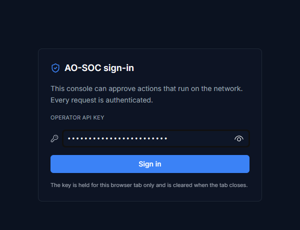

1. Open the dashboard URL.
2. Paste your **Operator API key** into the box.
3. Click **Sign in**.

The key is kept **for this browser tab only**. Closing the tab signs you out, so a shared
SOC workstation does not stay signed in for the next shift. If the key is wrong or has
been revoked, the sign-in screen comes back.

---

## 4. The screen layout and the top bar

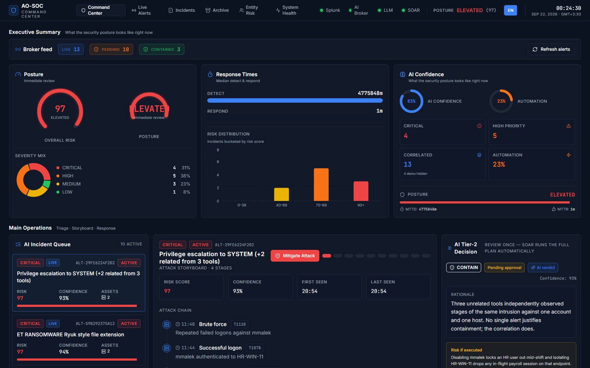

Every page has the same **top bar**:

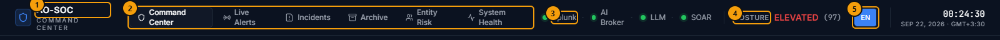

| # | Element | What it does |
|---|---|---|
| 1 | **AO-SOC logo** | Returns to the Command Center |
| 2 | **Main menu** | The six pages (table below) |
| 3 | **Pipeline status** (Splunk · AI Broker · LLM · SOAR) | A green dot means the part is online, amber degraded, red offline, grey unknown. Refreshed every 5 seconds |
| 4 | **Posture** | Overall security posture (`LOW` / `GUARDED` / `HEIGHTENED` / `ELEVATED`) with its score from 0 to 100 |
| 5 | **EN / FA** | Switches the language between English and Persian (right-to-left layout) |
| – | **Clock** | Local time and date with the time-zone offset |

**The main menu**

| Menu item | Page | Use it to… |
|---|---|---|
| **Command Center** | `/` | See everything at once and work incidents. This is your home screen |
| **Live Alerts** | `/alerts` | Scan the raw alert log and see each alert's containment playbook |
| **Incidents** | `/incidents` | See the full list of active incidents and open one in detail |
| **Archive** | `/archive` | Review cleared incidents: what was decided, who approved it, what ran |
| **Entity Risk** | `/entities` | See the riskiest users, hosts and IP addresses |
| **System Health** | `/health` | Check that the pipeline is alive and look at its telemetry |

The **footer** shows the application version (for example `v2.8.8`) and the pipeline
`Splunk → AI Broker → Local LLM (Qwen) → SOAR`. Quote the version when you report a
problem.

---

## 5. Command Center (home page)

The Command Center answers five questions from top to bottom: *What needs attention now?
How serious is it? Why does the AI think so? What should be done? What is our posture?*
It has six rows.

### 5.1 Executive Summary: "how are we doing right now?"

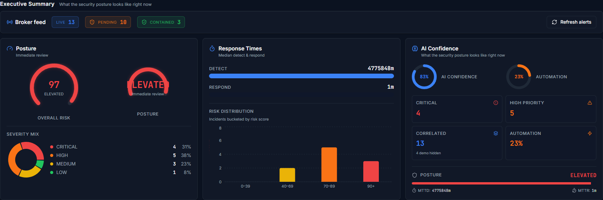

- **Broker feed.** Counts of **LIVE** incidents, incidents **PENDING** a human decision,
  and **CONTAINED** ones. **Refresh alerts** reloads them immediately. The page also
  refreshes by itself every 15 seconds.
- **Posture.** The overall risk gauge (0–100) with its label, plus the **Severity Mix**
  donut of open incidents.
- **Response Times.** **MTTD** (mean time to detect) and **MTTR** (mean time to respond),
  plus the **Risk Distribution** histogram of incidents by risk score.
- **AI Confidence.** The average model confidence, the automation rate, and counts of
  **Critical**, **High Priority** and **Correlated** incidents.

> **AI confidence is shown, never used to decide.** Local models report 75–98 %
> confidence almost regardless of the input. Use the number to sort your work, not as a
> reason to approve.

### 5.2 Main Operations: triage, storyboard and response

This is where you work incidents.

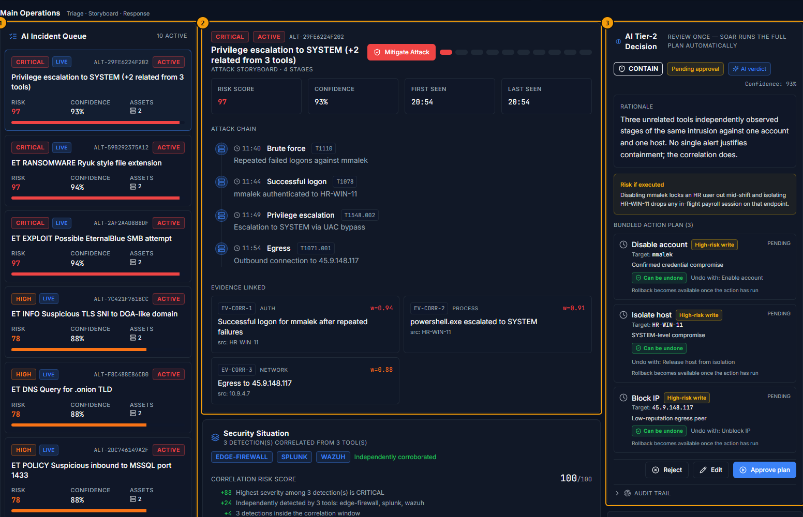

| # | Panel | What it shows |
|---|---|---|
| 1 | **AI Incident Queue** | Active incidents, most urgent first. Click one to select it; everything to its right then shows that incident |
| 2 | **Attack storyboard** and the panels below it | What happened, in order, and the evidence behind it |
| 3 | **AI Tier-2 Decision** and **AI Recommended Actions** | What the AI proposes, and the buttons you act with (Section 6) |

#### AI Incident Queue

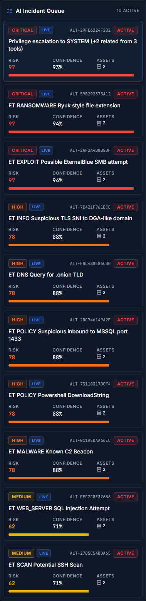

Each card shows the **severity** (`CRITICAL`, `HIGH`, `MEDIUM`, `LOW`), a **LIVE** badge
(real broker data; `DEMO` marks sample data), the incident id, its **status**, the
title, the **risk** score, the AI **confidence** and the number of affected **assets**.
The bar at the bottom of each card is the risk score, coloured by severity.

A title such as *"Privilege escalation to SYSTEM (+2 related from 3 tools)"* means
AO-SOC joined three detections from three different tools into one situation.

#### Attack storyboard

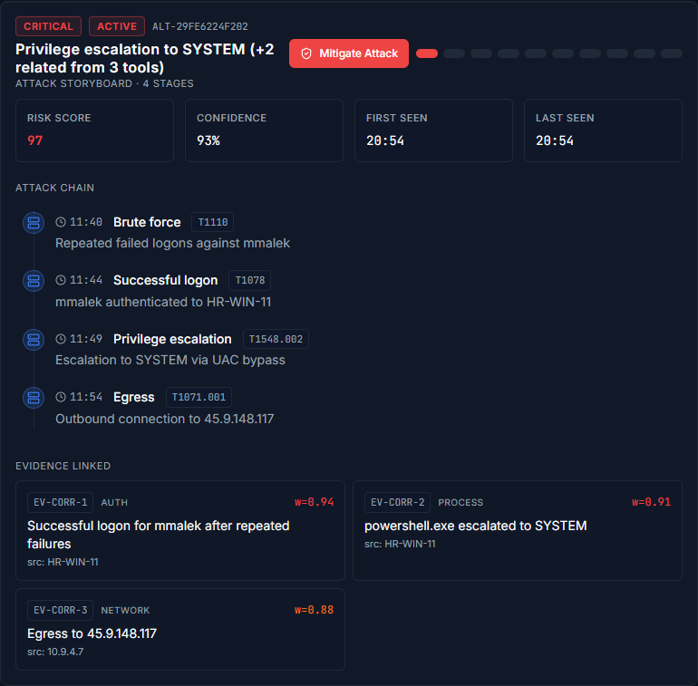

- The header row shows the **risk score**, **confidence**, **first seen** and **last seen**.
- **Attack chain.** Each stage of the attack in time order, with its MITRE ATT&CK
  technique id (for example `T1110` Brute force).
- **Evidence linked.** The individual pieces of evidence, their type (auth, process,
  network) and weight.
- **Mitigate Attack** (red button). Marks the incident **CONTAINED** by hand, **without**
  running the plan. Use it only when the threat was already contained outside AO-SOC. The
  normal route is **Approve plan** (Section 6).

#### Security Situation: why several alerts became one incident

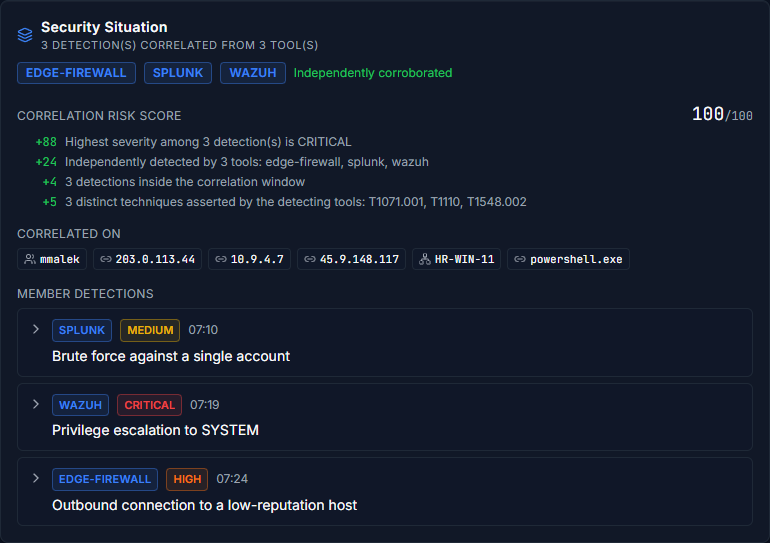

- **Tool badges** (for example `EDGE-FIREWALL`, `SPLUNK`, `WAZUH`) name the tools that
  reported it. **Independently corroborated** means more than one tool saw it.
- **Correlation risk score.** Shows the arithmetic, line by line: the points for the
  highest severity, for cross-tool corroboration, for the number of detections and for the
  number of techniques. The score is a count of facts, not the AI's opinion.
- **Correlated on.** The shared users, addresses, hosts and processes that joined the
  detections.
- **Member detections.** Every original detection. Click `>` to expand one and see its
  entities, techniques and a link back to the tool that raised it.

#### Verification and precedent

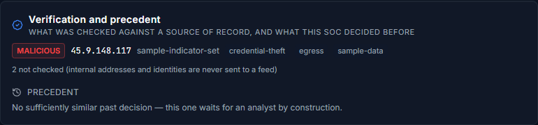

- **Indicators checked against threat intelligence.** `MALICIOUS` means the indicator is
  on a feed. *Checked and not found* is **not** proof that it is safe. *Not checked*
  covers internal addresses and identities, which are never sent to a feed.
- **Precedent.** What this SOC decided in similar past cases. *"No sufficiently similar
  past decision"* means the incident waits for a person by design.

> A quiet panel is not a clean result. If no intelligence feed is configured, the panel
> says so.

#### Case: who owns this incident

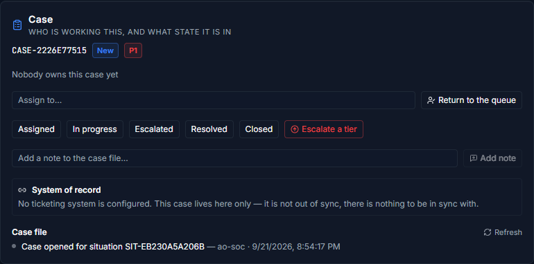

- The **case id**, its **state** and its **priority** (`P1` is the highest).
- **Assign to…** Type a name and click **Assign**. **Return to the queue** unassigns it.
- **State buttons** move the case through its lifecycle:
  `New → Assigned → In progress → Escalated → Resolved → Closed`, and
  `Reopened` from Resolved or Closed. Only the valid next states are shown.
- **Escalate a tier** raises the case to the next tier.
- **Add a note** writes to the **Case file**, the case's timeline, which cannot be edited
  afterwards.
- **System of record.** Shows whether the case is synced to a ticketing system (for
  example TheHive). *"No ticketing system is configured"* is a normal state, not an error.

> Nothing in the Case panel can approve or reject a decision. Owning a case and deciding
> what to do about it are deliberately separate.

#### AI Recommended Actions

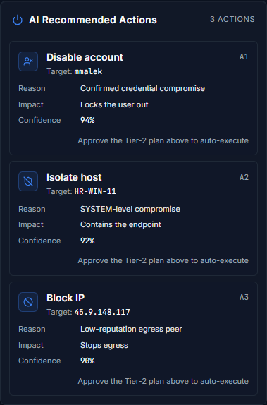

The same actions as the plan, each with its **target**, **reason**, **impact** and
**confidence**. For live incidents you do not run these one by one. The note
*"Approve the Tier-2 plan above to auto-execute"* tells you to use **Approve plan**.

### 5.3 Risk Analytics

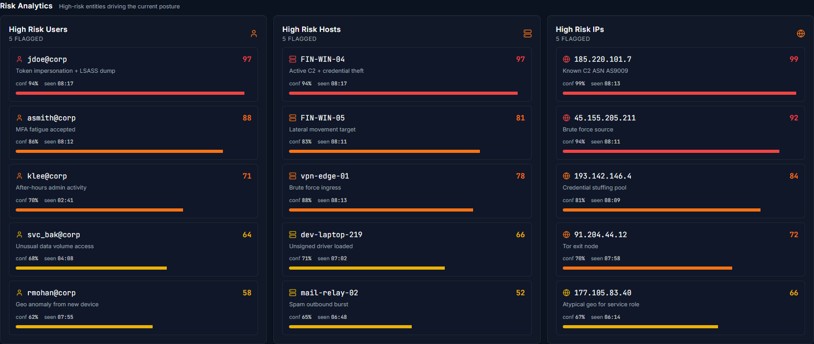

The highest-risk **users**, **hosts** and **IP addresses** driving the current posture.
The **Entity Risk** page (Section 10) has the full, searchable list.

### 5.4 MITRE ATT&CK

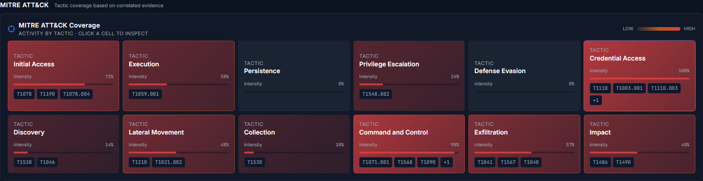

Activity by ATT&CK **tactic**. Redder cells mean more intensity. Each cell lists the
technique ids seen. Click a cell to inspect it. Techniques are checked against a local
ATT&CK catalogue, and an id the catalogue does not list is flagged as *unlisted* rather
than presented as fact.

### 5.5 AI Explanation

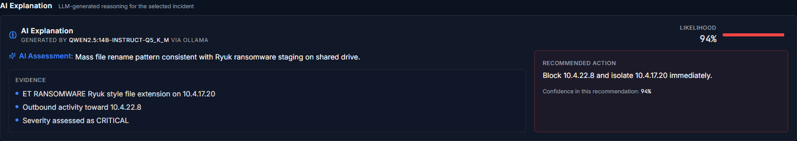

The local model's reasoning for the selected incident: its **assessment**, the
**evidence** it relied on, its **recommended action** and its **likelihood**. The panel
also names the model that wrote it (for example `qwen2.5:14b-instruct via Ollama`).

### 5.6 System Health (panel)

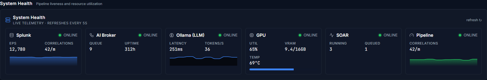

A compact version of the System Health page (Section 11).

---

## 6. Working an incident: the AI Tier-2 Decision

This panel is the heart of AO-SOC. You **review once**, and the response tools then run
the whole plan.

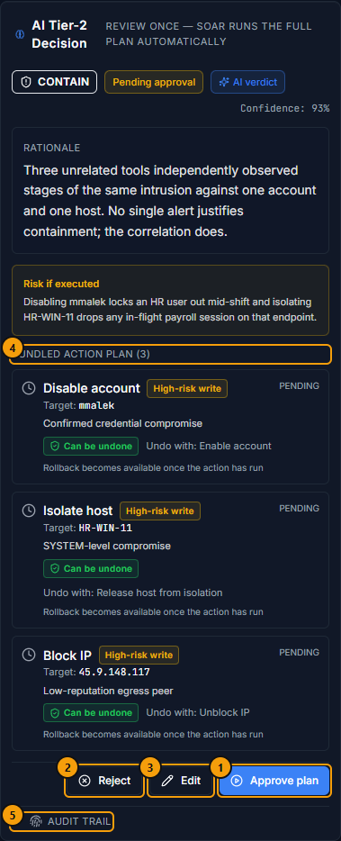

**Reading the panel from top to bottom**

- **Verdict**: `CONTAIN`, `ESCALATE`, `INVESTIGATE`, `MONITOR` or `IGNORE`.
- **Status**: `Pending approval` → `Approved` → `Executing` → `Complete`. Also possible:
  `Rejected`, `Failed`, `Dry run`, `Superseded`.
- **Who decided**:
  - **AI verdict**: the model produced the decision.
  - **Rule fallback**: the model gave no usable answer, so a severity rule decided. Read
    these more carefully.
  - **Analyst corrected**: a person edited it.
- **Rationale**: why, in plain language.
- **Risk if executed** (amber box): what the plan could break. For example, disabling an
  HR user in the middle of their shift.
- **(4) Bundled action plan**: each action with:
  - its **target** (IP address, host or account) and reason,
  - its **risk class**: `Read`, `Low-risk write`, `High-risk write` or `Destructive`,
  - its **reversibility**: **Can be undone** (with the undo action shown), **Cannot be
    undone**, or **Nothing to undo**,
  - a guard badge where it applies: **Critical asset**, **Privileged account** or
    **Service account**. Autopilot never runs these; a person must approve them.
- **Buttons**: **(1) Approve plan**, **(2) Reject**, **(3) Edit**.
- **(5) Audit trail**: how the decision was produced (Section 6.4).

### 6.1 Approve the plan

1. Read the **rationale**, the **Security Situation** and the **Risk if executed** box.
2. Check every **target** in the plan. Is it the right host, account or address?
3. Click **Approve plan**.

Every action is queued and runs automatically. The status of each action changes from
`PENDING` to `EXECUTING` and then `DONE`. When they all succeed, the incident is
**cleared**: it leaves the queue, moves to the **Archive**, and a green banner announces
it.

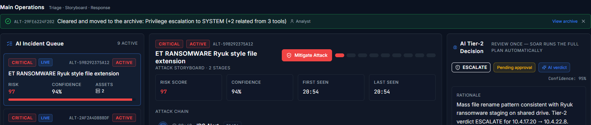

Click **View archive** to see it, or **✕** to dismiss the banner.

> **Dry run.** When the deployment runs with `RESPONSE_DRY_RUN=true`, actions show
> **Dry run** (amber) instead of **Complete**: *"nothing was sent to any executor"*. The
> incident is **not** marked contained. This is deliberate, because a simulated
> containment must never look like a real one.

### 6.2 Edit the plan (correct the AI)

Use **Edit** when the AI is *partly* right: the verdict is wrong, a target is wrong, or an
action is missing or unnecessary.

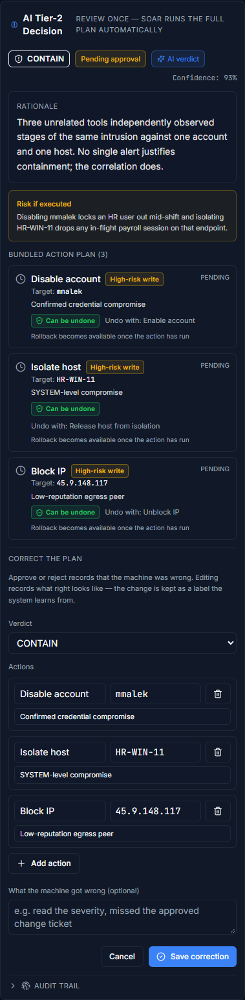

1. Click **Edit**.
2. Change the **Verdict** if needed.
3. Change any action's name, target or reason. **Add action** adds a row, and the bin
   icon removes one.
4. Optionally, write **what the machine got wrong**, for example *"missed the approved
   change ticket"*.
5. Click **Save correction**, then approve the corrected plan.

Your correction is stored as a **label** that the system learns from. It feeds the
*precedent* that later decisions are compared with. Editing is how the system gets better,
so an edit is more useful than a silent reject.

AO-SOC refuses an edit that could never run, for example a *Block IP* action whose target
is not an IP address. A plan that has already been executed cannot be edited, because it
is the record of what was sent.

### 6.3 Reject the plan

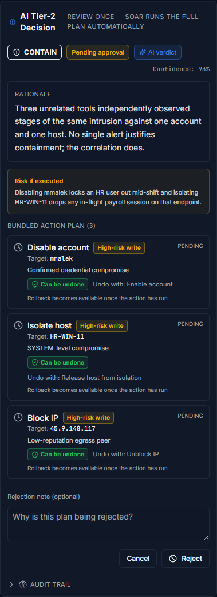

1. Click **Reject**.
2. Optionally, write **why** in the rejection note.
3. Confirm with **Reject**.

Nothing runs. Use Reject when no action is warranted, for example for an authorised
scanner or a known false positive.

### 6.4 Audit trail

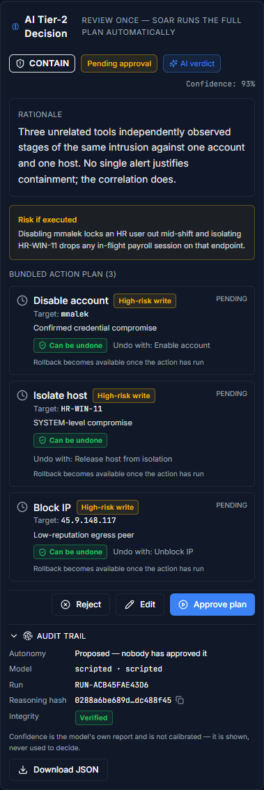

Click **Audit trail** to expand it. It shows:

- **Autonomy**: *Proposed* (nobody has approved it yet), *Supervised* (a person approved
  it) or *Autonomous* (autopilot approved it on precedent).
- **Model** and **Run**: which model produced the decision, and the id of that run.
- **Reasoning hash** (copy button) and **Integrity**: `Verified` means the stored prompt
  and answer still match their hash. `Mismatch` means the record was altered.
- **Download JSON**: the complete decision envelope (situation, decision, actions and
  audit trail), for reports or evidence.

### 6.5 Record what actually happened

After a decision settles, the panel asks **What actually happened**, and you can answer
for 72 hours (configurable):

- **True positive**: it was a real attack.
- **False positive**: it was not.
- **Reopened**: it came back.

Please record an outcome. These answers decide which detection sources and verdicts are
trustworthy enough ever to be automated.

### 6.6 Autopilot (if enabled)

When a site turns autopilot on, some decisions run **without** a click. Autopilot does
this only when **enough similar past cases were confirmed by people with the same
verdict, none were reversed, and the newest is recent**. It **never** automates:

- actions on a **critical asset** (domain controllers, databases and anything else the
  site lists),
- disabling or resetting a **privileged** or **service** account,
- an action that **cannot be undone**,
- a **destructive** action.

In the Archive, incidents that autopilot cleared carry an **Autopilot** badge instead of
**Analyst**.

---

## 7. Live Alerts and the Incident Playbook

**Menu: Live Alerts.** The raw alert log from the broker, for fast scanning.

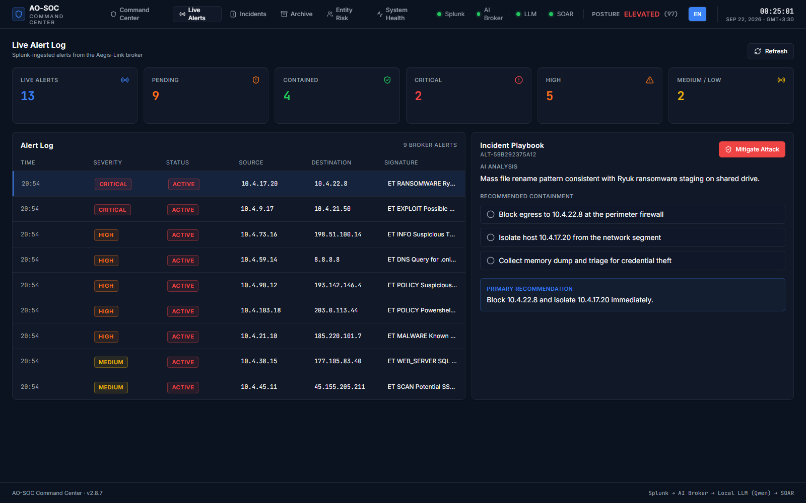

- **Top tiles**: counts of **Live alerts**, **Pending**, **Contained**, **Critical**,
  **High** and **Medium / Low**.
- **Alert Log**: time, severity, status, source and destination addresses, and the
  signature. **Refresh** reloads the log.

**Click an alert** to open its **Incident Playbook** on the right:

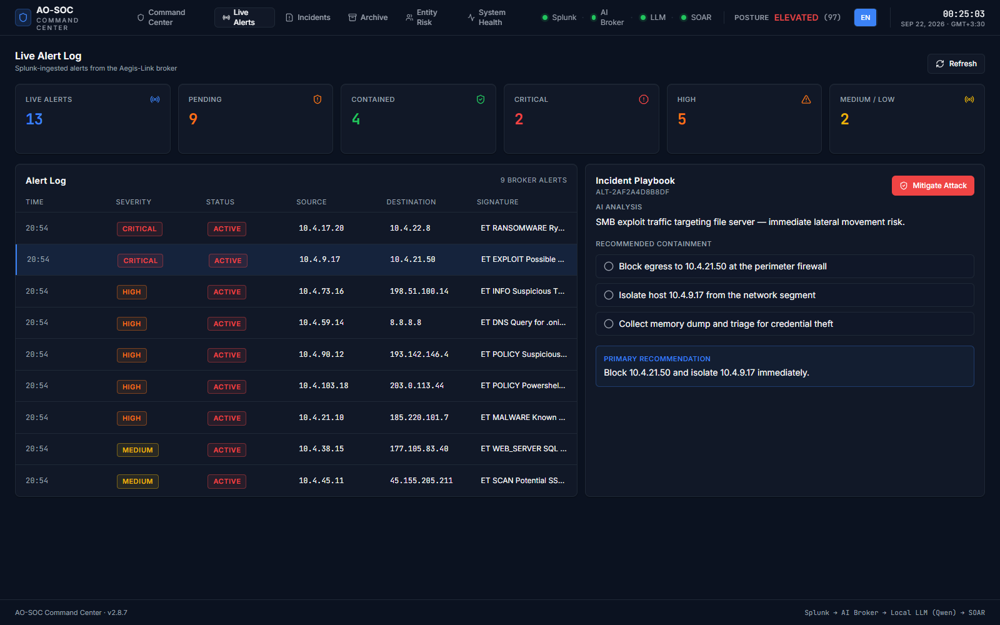

- **AI analysis**: a one-line summary.
- **Recommended containment**: the playbook steps as a checklist. A step turns green with
  a tick once it has been done.
- **Primary recommendation**: the single most important step.
- **Mitigate Attack**: marks the alert contained by hand (see Section 5.2).

To **approve and run** the playbook, open the incident in the **Command Center** or on
its **details page** and use **Approve plan** (Section 6).

---

## 8. Incidents list and Incident details

### 8.1 Incidents

**Menu: Incidents.** Every active incident in one table.

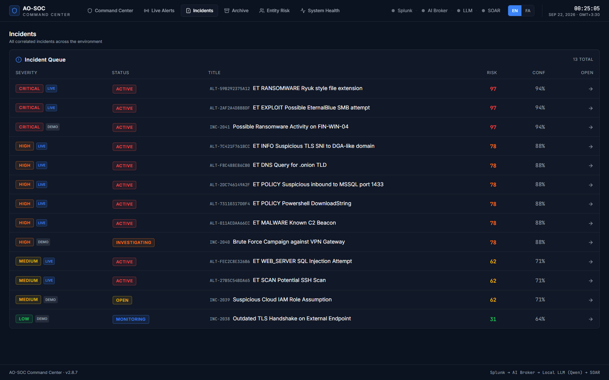

The columns are severity, status (with a `LIVE` or `DEMO` badge), title, **risk**, AI
**confidence**, and **Open**. Click a row to open the incident's details page.

### 8.2 Incident details

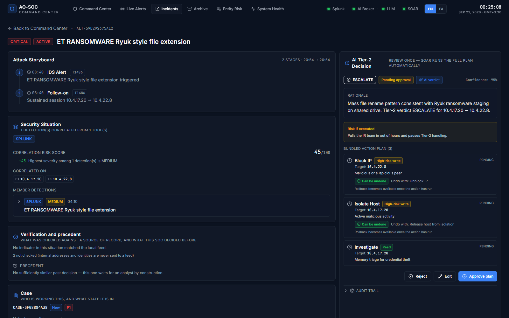

One page per incident, with everything in one place:

- **Back to Command Center** link, the incident id, severity, status and title.
- **Left column**: the **Attack Storyboard**, **Security Situation**, **Verification and
  precedent**, **Case** and **AI Explanation**.
- **Right column**: the **AI Tier-2 Decision** (with all its buttons), **Affected
  Assets**, **MITRE Techniques** and **AI Recommended Actions**.

Use this page when you want to share a link to one incident, or to **roll back** an
action on an incident that is already contained (Section 9.2).

---

## 9. Archive and rolling actions back

### 9.1 Archive

**Menu: Archive.** Cleared incidents, newest first.

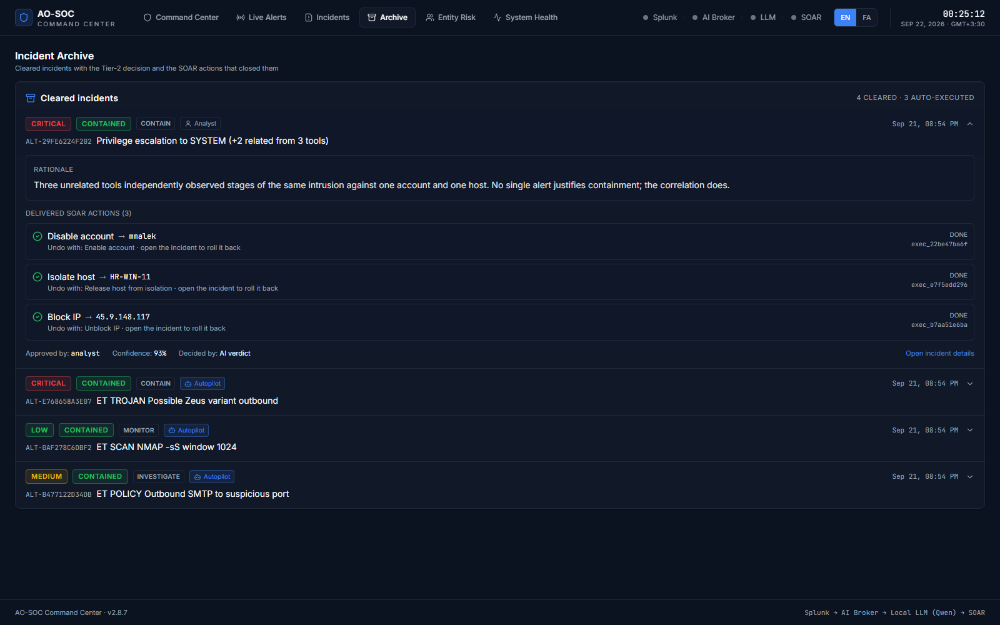

- The header counts the incidents **cleared** and how many were **auto-executed**.
- Each row shows the severity, `CONTAINED`, the verdict, and **Analyst** or
  **Autopilot**: who approved it.
- **Click a row** to expand it and see the **rationale**, every **delivered SOAR action**
  with its status and execution id, who approved it, its confidence and its decision
  source.
- **Open incident details** opens the full incident page.

### 9.2 Roll back an action

Any action marked **Can be undone** can be reversed after it has run. For example, a
*Block IP* is undone with *Unblock IP*.

1. From the Archive, click **Open incident details**. You can also use the Command Center
   if the incident is still active.
2. In the AI Tier-2 Decision panel, find the action and click **Roll back**.

   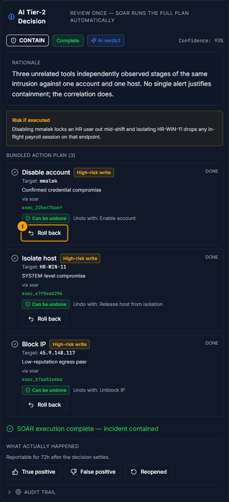

3. Optionally, write **why**, for example *"change window CHG-2211 approved this
   traffic"*.
4. Click **Roll back** again to confirm.

   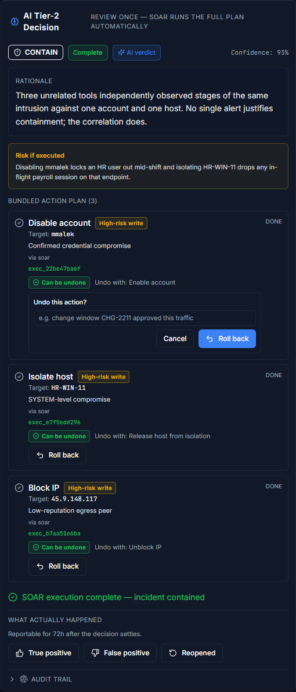

The undo action goes through the same route as the original. The action then shows
**Rolled back by** *your name*, and the incident **reopens** instead of staying
"contained". The case file records who undid what.

- The **Roll back** button appears only **after** the action has run.
- An action marked **Cannot be undone** has no Roll back button.
- *"The executor refused the rollback"* means the response tool has no undo command
  configured. Undo the action in that tool directly.

---

## 10. Entity Risk

**Menu: Entity Risk.** The highest-scoring entities across the environment.

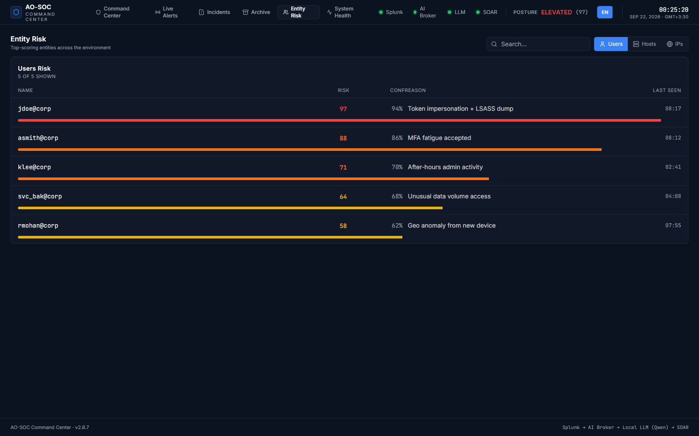

- Use the tabs on the right to switch between **Users**, **Hosts** and **IPs**.
- **Search…** filters the list as you type.
- Each row shows the name, the **risk** score (with a coloured bar), the model's
  **confidence**, the **reason** and when it was **last seen**.

Use this page to answer *"who or what is most at risk right now?"*, and to check whether
an account or host from an incident already has a history.

---

## 11. System Health

**Menu: System Health.** Is the pipeline alive?

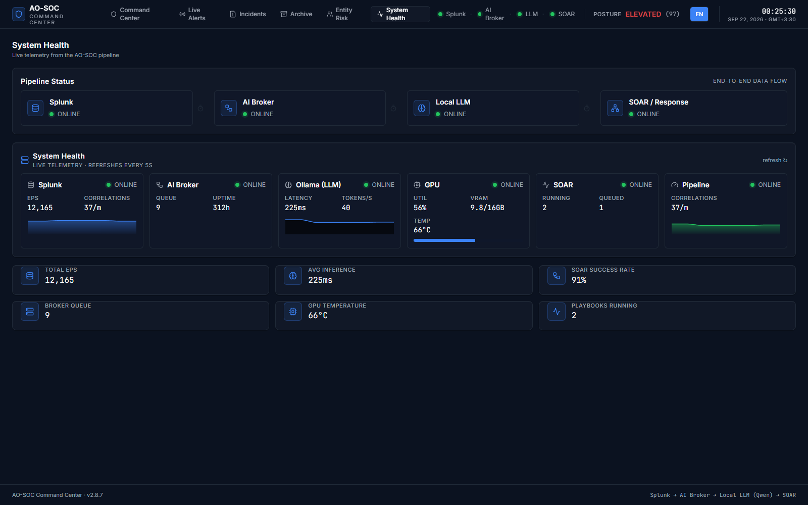

- **Pipeline Status**: **Splunk → AI Broker → Local LLM → SOAR / Response**, each
  `ONLINE`, `DEGRADED`, `OFFLINE` or `UNKNOWN`.
- **Live telemetry** (refreshed every 5 seconds): events per second and correlations
  (Splunk), queue depth and uptime (AI Broker), latency and tokens per second (the
  model), GPU utilisation, VRAM and temperature, and SOAR actions running and queued.
- **Summary tiles**: total EPS, average inference time, SOAR success rate, broker queue,
  GPU temperature and playbooks running.

If a component is red or grey, see [Section 15](#15-troubleshooting).

---

## 12. Language: English and Persian

Click **FA** in the top bar to switch to Persian, and **EN** to switch back. The whole
interface changes to right-to-left, including labels, dates and risk explanations. The
choice is remembered in this browser.

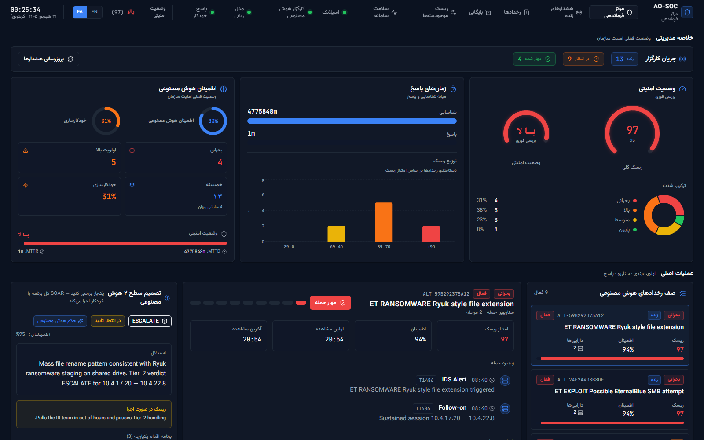

---

## 13. A daily routine

**At the start of a shift**

1. Sign in with **your own** key.
2. Look at the top bar: are all four pipeline dots **green**? If not, open **System
   Health**.
3. Read the **Executive Summary**: the posture, how many incidents are **PENDING**, and
   the severity mix.

**During the shift, for each incident in the AI Incident Queue (top first)**

1. **Select it.**
2. **Read**: the storyboard, then the **Security Situation** (what joined it together),
   then **Verification and precedent**.
3. **Take ownership**: in **Case**, assign it to yourself and set it to *In progress*.
4. **Decide**, in the AI Tier-2 Decision panel:
   - the plan is right → **Approve plan**,
   - the plan is partly wrong → **Edit**, then approve,
   - nothing should run → **Reject**, with a note,
   - it needs a higher tier → **Escalate a tier** in the Case panel.
5. **Note** anything useful in the case file.
6. When it clears, check the **Archive** entry.

**At the end of the shift**

1. For decisions that settled today, record **True positive / False positive /
   Reopened**.
2. Hand over any case that is still *In progress*: add a note and reassign it.
3. Close the browser tab. This signs you out.

**For the shift lead (weekly)**: take and verify a backup (see the runbook, section 7),
and review which detection sources produce false positives.

---

## 14. Glossary: badges, colours and statuses

**Severity colours**: `CRITICAL` red · `HIGH` orange · `MEDIUM` yellow · `LOW` green.

**Posture**: `LOW` → `GUARDED` → `HEIGHTENED` → `ELEVATED` (the worst).

| Term | Meaning |
|---|---|
| **LIVE** / **DEMO** | Real data from the broker / built-in sample data |
| **Situation** | One or more detections, possibly from several tools, about the same entities within a time window |
| **Tier-2 decision** | The verdict: `CONTAIN` (act now), `ESCALATE` (bring in a higher tier or IR), `INVESTIGATE` (look deeper), `MONITOR` (watch), `IGNORE` (no action) |
| **Bundled action plan** | The playbook: the set of actions attached to a decision, approved and run together |
| **AI verdict / Rule fallback / Analyst corrected** | Whether the model, a severity rule or a person produced the decision |
| **Read / Low-risk write / High-risk write / Destructive** | How much an action changes. Destructive actions are refused unless a site enables them deliberately |
| **Can be undone / Cannot be undone / Nothing to undo** | Whether the action can be rolled back |
| **Critical asset / Privileged account / Service account** | Targets autopilot never touches |
| **Pending approval → Approved → Executing → Complete** | The normal status sequence of a plan |
| **Failed** | The response tool answered and declined. The reason is in the receipt |
| **Blocked** | The action never left AO-SOC. The target was malformed, or no tool performs it |
| **Dry run** | Simulated only. Nothing was sent to any tool |
| **Superseded** | The situation was merged into another one, and the live decision is there |
| **Precedent** | Similar past cases that people decided, which autopilot relies on |
| **Case states** | `New`, `Assigned`, `In progress`, `Escalated`, `Resolved`, `Closed`, `Reopened` |
| **MTTD / MTTR** | Mean time to detect / mean time to respond |

---

## 15. Troubleshooting

| Symptom | What to do |
|---|---|
| The sign-in screen keeps coming back | The key is wrong, revoked, or belongs to the broker rather than the dashboard. Ask your administrator for a key from `AOSOC_API_KEYS` |
| *"Failed to load dashboard … port 4317"* | The UI API is not running. Demo: restart with `start-demo`. Docker: `docker compose -f deploy/docker-compose.yml ps` |
| The queue is empty | Check that the detection tools are sending to the broker with an **ingest** key. Demo: rerun `start-demo`, or on Windows run `orchestrator\trigger-alert.ps1` |
| New incidents stopped getting decisions | The analysis queue may hold failed jobs. Ask the administrator to check `GET /api/queue` on the broker. Detections are stored regardless and can be retried |
| Every decision says **Rule fallback** | The model is not answering. Check the **LLM** dot and System Health; make sure Ollama is running and the model is pulled |
| An action shows **Failed** | The response tool refused it. The reason is in the delivery receipt. Fix it in that tool, or edit the plan |
| An action shows **Blocked** | The target is not valid for that action, or no connector performs it. **Edit** the plan and correct the target |
| Everything shows **Dry run** | The deployment is still in dry-run mode (`RESPONSE_DRY_RUN=true`). This is by design until the pilot runbook's Stage 2 |
| A case will not change state | That transition is not allowed. Only the buttons shown are valid next states |
| Pipeline dots are grey (`UNKNOWN`) | The health check has not answered yet. Wait 5 seconds or reload. If they stay grey, check that the broker is running |

When you report a problem, include the **version** from the footer, the **incident id**
(for example `ALT-8AE6D52F8208`), and if possible the **Download JSON** file from the
Audit trail.

---

## Change log

| Version | Date | What changed | Author |
|---|---|---|---|
| 1.0 | Summer 2026 | First edition, for `ao-soc` 2.8.8: installation (demo and Docker), sign-in, every menu and page, the Tier-2 workflow (approve, edit, reject, audit, outcome, rollback), Live Alerts playbook, daily routine, glossary and troubleshooting. 31 screenshots from the demo stack | J.Ekrami, Claude (Opus 5) |
